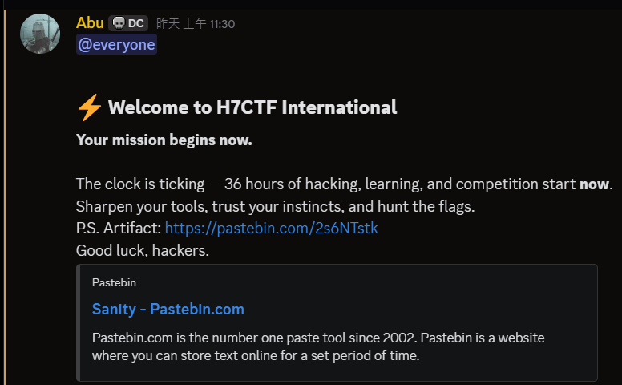
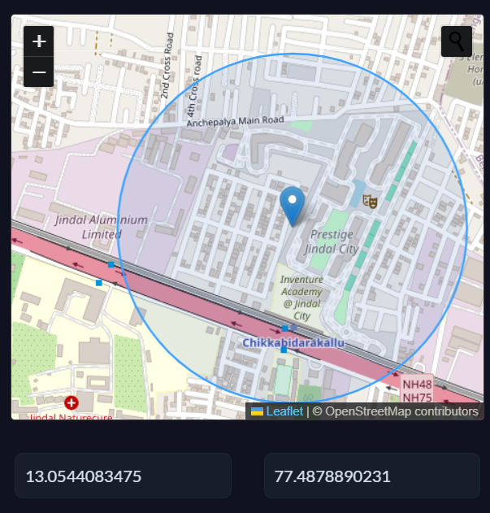

## Before Start...

原本要打 LINE CTF 結果發現打不動  :skull:  

## Misc

### 検証  
> Everything you need is already in your hands.  

簽到題  
不外乎是在 DC 逛街找 flag  
很神奇的是我在頻道清單上居然看不到公告頻  
應該是權限有設錯(?  
然後在其他頻道有看到公告頻的連結  

  

給了一個 [pastepbin](https://pastebin.com/2s6NTstk) 連結  
進去之後是

```brainfuck
++++++++++[>+>+++>+++++++>++++++++++<<<<-]>>>>++++.<---------------.>-----.+++++++++++++++++.--------------.+++++++++++++++++++++.----.---------------.<-------.>---------.+++++++++++++++++++++.--------------.-------.+++++++++++++++++.+++++.-.-.--------------------.+++++++.++++++.<++++.>-----.++++++++++++.--------------------.<---.>+++++++++++++++.---------------.+++++++++++++++++++++.------------.<++.>---------.+++++.<+.>+++++++++.+.---------------.+++++++++++++++++++++++.-----------------.+++++++++++++.<---.>------------.<.>---.<+++.>+++++++++++++++++.<---.-.>------.---------------.++++++++++++++.<++++.---.>-.+++++++.<++++++++++++++.>++++++++++.
```

brainfuck 直接線上執行就可以了

Flag: `h7ctf{wh0_tf_puts_fl4gs_1n_th3_d4mn_ver1f1c4t10n_m41ls?}`

---

## Crypto
### Baby Sharingan
> Can you see what Kakashi sees?  

chal file: [Scroll.txt](./chal/Scroll.txt)  

題目看著沒什麼想法  
考慮這題是 Crypto 加上檔案中有 Signature 這個詞  
猜測可能是 hash   
`48377465787b7468335f73683472316e67346e5f72337633346c735f346c6c5f733363723374737d4837746578`  
拿去 [hashes.com](https://hashes.com/en/decrypt/hash) 解  
就拿到 Flag 了  
結果他只是 hex :skull: 

Flag: `H7tex{th3_sh4r1ng4n_r3v34ls_4ll_s3cr3ts}`

---

## OSINT
### High Rise

>Point out the building from which the photo was captured.  

chal file: [IMG_2969.HEIC](./chal/IMG_2969.HEIC)  

  

從 Metadata 沒看出什麼線索  
決定以圖搜圖  
然後 Google 甩了一篇 Reddit 的貼文給我  
[Reddit Link](https://www.reddit.com/r/geography/comments/1o9pxj3/help_me_find_the_location/)  
看來有人使用了~~座標之力~~社群之力    
那我就心懷感激地收下了  
是說這樣是可以的嗎?   

  

---

## Pwn

### Mauryan Imperial Archives
> Emperor Ashoka's Mauryan Empire established comprehensive administrative systems with multiple layers of authentication for accessing royal edicts and imperial records.  
Analyze the imperial authentication system that protects the royal archives to find the flag.  

chal file: [imperial_archive](./chal/imperial_archive)  

Decompile of Important functions:
```c {hl_lines=[15, 27]}
void scribe_function()
{
  char buffer[264]; // [esp+0h] [ebp-108h] BYREF

  puts("Welcome to the Mauryan Imperial Authentication System");
  printf("Enter the royal inscription: ");
  fflush(stdout);
  if ( !fgets(buffer, 256, stdin) )
  {
    puts("Error reading inscription");
    exit(1);
  }
  buffer[strcspn(buffer, "\n")] = 0;
  printf("Processing inscription: ");
  printf(buffer); // format string vulnerability
  putchar(10);
  puts("Verifying imperial authority...");
  imperial_access();
}

void imperial_access()
{
  int *v0; // eax
  char flag[256]; // [esp+Ch] [ebp-10Ch] BYREF
  FILE *flag_file; // [esp+10Ch] [ebp-Ch]

  if ( mauryan_empire == 321 && ashoka_edict > 14714 )
  {
    puts("Glory to the Mauryan Empire! Access granted to the royal archives!");
    puts("Royal Inscription: ");
    flag_file = fopen("flag.txt", "r");
    if ( !flag_file )
    {
      v0 = __errno_location();
      printf("Error: Failed to open flag.txt (errno: %d)\n", *v0);
      exit(1);
    }
    if ( !fgets(flag, 256, flag_file) )
    {
      puts("Error: Failed to read from flag.txt");
      fclose(flag_file);
      exit(1);
    }
    printf("Flag: %s", flag);
    fclose(flag_file);
    exit(0);
  }
  puts("Access denied.");
}
```

在 L15 可以看到 `printf(buffer);`  
明顯可以做 format string 來讀寫 stack  
而 L27 的條件 `if ( mauryan_empire == 321 && ashoka_edict > 14714 )`  
是我們要達成的目標  
從 ida 找出這兩個全域變數的位置分別在  
`0x0804c06c` (mauryan_empire)    
`0x0804c070` (ashoka_edict)  

使用 `fmtstr_payload(offset, {address: value})` 來寫入  
在那之前須要先知道 offset 是多少  
透過輸入`AAAA%p%p%p%p%p%p%p%p`  
```
Enter the royal inscription: AAAA%p%p%p%p%p%p%p%p
Processing inscription: AAAA0x804a4520xf7ea05c0(nil)0x414141410x702570250x702570250x702570250x70257025
```

可以知道 offset 是 4  

exploit [here](./solve/imperial.py)  

Flag: `H7CTF{m4ury4n_pi114r_c1ph3r_3218C3_7df85944-0ca1-4790-b80a-d8427c50bab8}`


Gemini can solve this challenge with only provided decompile functions and global variables address!


---

