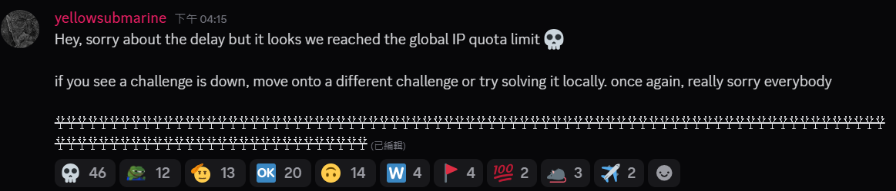
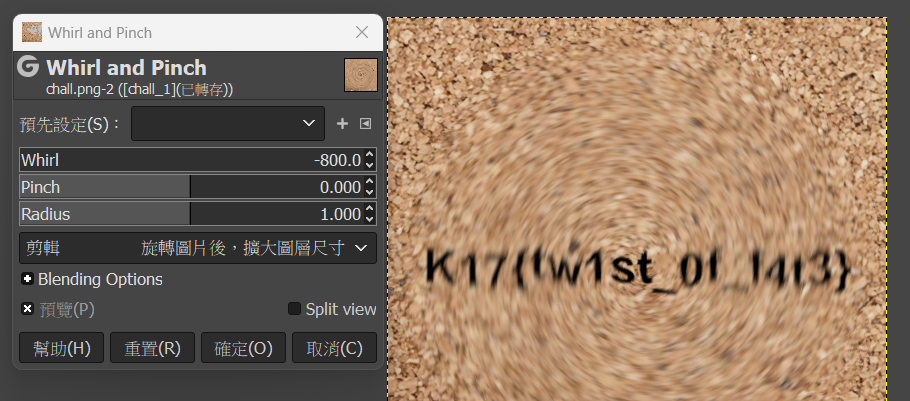
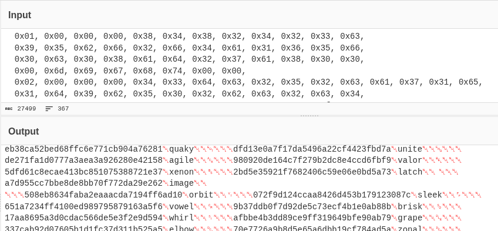
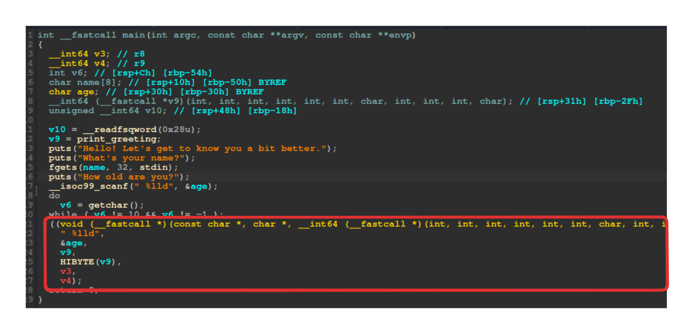


This is post is a translation of <a href="/posts/k17ctf_write_up/">K17CTF Write Up (ZH)</a>.<br>
Translate by Github Copilot use GPT-4.1 .


Because I didn't want to do my linear algebra homework, I played some CTF to pretend I was being productive.

rk: #276 / 972 

## META
### sanity check
Tag: `intro`  

Welcome challenge  
flag in rule  

Flag: `K17{we_hop3_y0u_h@ve_Fun}`

---  

### discord
Tag: `intro`  

Just join the DC server  
In the `#announcements` channel  
  

This chunk looks suspicious, right?  

```
žŸžžŸžŸŸžžŸŸžžžŸžžŸŸžŸŸŸžŸŸŸŸžŸŸžŸŸŸžŸŸŸžŸŸžžŸžŸžŸžžŸŸžžžŸŸžžžŸŸžžŸŸžžžžžŸŸžŸŸžŸžžŸŸžžŸŸžŸžŸŸŸŸŸžŸŸŸžŸžžžžŸŸžžžžžŸžŸŸŸŸŸžŸŸžŸžŸŸžžŸŸžžžŸžžŸŸžŸŸŸžŸžŸŸŸŸŸžŸžžžžŸŸžžŸŸžŸŸŸžŸžžžŸŸžžžŸžžžžŸžžŸžžžžŸžžŸžžžžŸžŸŸŸŸŸžŸ
```

Copy and paste into [CyberChef](https://gchq.github.io/CyberChef/#recipe=To_Hex('Space',0)Find_/_Replace(%7B'option':'Regex','string':'9f'%7D,'1',true,false,true,false)Find_/_Replace(%7B'option':'Regex','string':'9e'%7D,'0',true,false,true,false)From_Binary('None',8)&input=np%2Benp%2Ben5%2Benp%2Bfnp6en56en5%2Ben5%2Bfnp%2Bfn5%2Ben5%2Ben5%2Bfnp%2Bfn56fn56en56fnp%2Benp%2Bfnp6en5%2Benp6fn56en5%2Benp6enp%2Bfnp%2Bfnp%2Benp%2Bfnp6fn56fnp%2Bfn5%2Bfnp%2Bfn56fnp6enp%2Bfnp6enp6fnp%2Bfn5%2Bfnp%2Bfnp%2Ben5%2Benp%2Bfnp6en56en5%2Ben5%2Bfnp%2Ben5%2Bfn5%2Ben56enp6fn56en5%2Ben5%2Bfnp%2Benp6fn56enp%2Benp6en56en56enp6fnp6fnp6enp%2Ben5%2Bfn5%2Benw&ieol=CRLF&oeol=CRLF) to convert to hex, you'll see a bunch of `9e` and `9f`.  
With only two symbols, it's intuitive to guess Morse code or binary.  
Just do some replacements and you'll get it.  

Flag: `K17{weLc0m3_t0_k17_C7F!!!}`

---

## beginner
### radioactive

Tag: `beginner`, `OSINT`

Find the location from the pictures.  
Round the latitude and longitude to three decimal places for the flag.

  


Search on [RFNSA](https://www.rfnsa.com.au/2154006)    


Flag: `K17{-33.717,150.987}`

---

### smoothie
Tag: `beginner`, `misc`  


The challenge gives a blurred image.  

Using `strings`, I found `Q3JlYXRlZCB3aXRoIEdJTVA=` which decodes to `Created with GIMP`.  
So I knew how to reverse it.  
Select the area and rotate clockwise to restore.  


Flag: `K17{tw1st_0f_f4t3}`

---

### daily re
Tag: `beginner`, `rev`, `web`

The challenge is a wordle game web page.  
The flag format is `K17{<72nd day word>, <73rd day word>, <74th day word>}`.  
You need to find the answers for days 72~74.  
Of course, start by checking the files.  
In the html, I saw:

```js
const DAY_NUMBER = 17;
const DAY_KEY = "70e7726a9b8d5e65a6dbb19cf784ad5a";
...
var Module = {
  onRuntimeInitialized: function() {
      let extracted_word = Module.ccall(
          'get_word',
          'string',
          ['number', 'string'],
          [DAY_NUMBER - 1, DAY_KEY]
      )
      if (!extracted_word) {
          console.error("Failed to get word!");
      }
      ...
```

`DAY_NUMBER` is given, but `DAY_KEY` seems impossible to guess.  
Found another file, a binary `word.wasm`, looks like it's time to reverse.

Using [wabt](https://github.com/WebAssembly/wabt) and `wasm2c`:

```bash
wasm2c ./word.wasm -o word.c
```

In `word.c`, I saw `data_segment_data_w2c_words_d0[]`, a hex array.    

Throw it into Cyberchef and observe, every 44 hex is a day's `DAY_KEY` and answer.  
You can use the earlier `DAY_KEY` to verify.  



No way I'm calculating up to 72 by hand, and going backwards isn't practical.  
Time for vibe coding! Script [here](./daily_re.py)

Output:
```
...
Block 72: limbo
Block 73: urban
Block 74: fiber
...
```

Flag: `K17{limbo, urban, fiber}`

---

### pass me the salt
Tag: `beginner`, `crypto`

The challenge is a simple account system, goal is to log in as admin.  

```py
if not check_login(login, pwd):
    print("Invalid login or password.")
    continue

if login == "admin":
    if pwd != "admin".encode().hex():
        print(f"Congratulations! Here is your flag: {os.getenv("FLAG")}")
```

Initially, admin is created as `create_account("admin", "admin".encode().hex())` 

```py {hl_lines=[5,15]}
def create_account(login, pwd):
    if login in logins.keys():
        return False
    salt = os.urandom(16)
    salted_pwd = salt + (pwd).encode()
    passw = sha1(salted_pwd).hexdigest()
    logins[login] = passw
    salts[login] = salt
    return True

def check_login(login, pwd):
    if login not in logins:
        return False
    salt = salts[login]
    salted_pwd = salt + bytes.fromhex(pwd)
    passw = sha1(salted_pwd).hexdigest()
    return passw == logins[login]
```
`"admin".encode().hex()` is `61646d696e`  
Password creation uses `"61646d696e".encode()`  
But login uses `bytes.fromhex(pwd)`  
So the input `pwd` must make `"61646d696e".encode()==bytes.fromhex(pwd)`  
Just hex-encode "61646d696e", which is "36313634366436393665"

script [here](./pass_me_the_salt.py)

Flag: `K17CTF{s4Lt_4nD_p3pper_is_ov3rr4t3d}`

---

### ezwins

chal [here](./ezwin)

Basically, the challenge gives a place to input a number.  
The program uses the input as an address to call.    

Plus, there's a `win` function (`0x4011f6`) to get a shell.  
So just input the address of `win` in decimal (`4198902`).  

I thought that was it, but it didn't work.  
Debugging showed that when calling `0x4011f6`, only `0x4011` remained.  
Because when preparing to call, one byte was missing.  

The fix is simple, since the last two bytes are lost, just shift forward.  
So `0x4011f600`, which is 1074918912, is the value to input.    
script [here](./ezwin.py)  
Flag: `K17{d1dn7_kn0w_u_c0u1d_b3_4ddr355_0f_w1n_m4ny_y34r5_0ld}`

---


# END

`ezwin` took me too long, I forgot all my pwn skills.  
Finally, there was a forensics challenge to extract a file from a pcap.  
The file seemed to be split and hidden in multiple DNS Queries.  
  

Didn't finish before time ran out.  

Alright, time to do my linear algebra homework.
