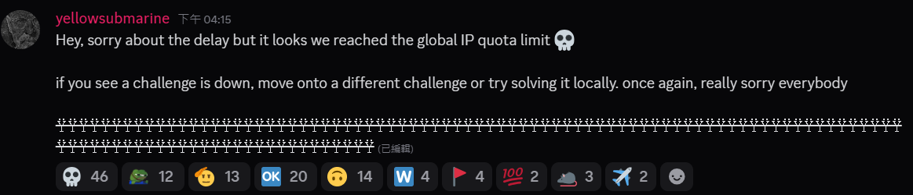
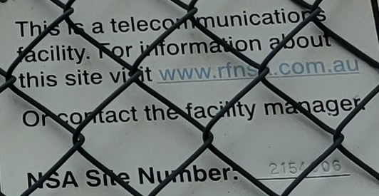
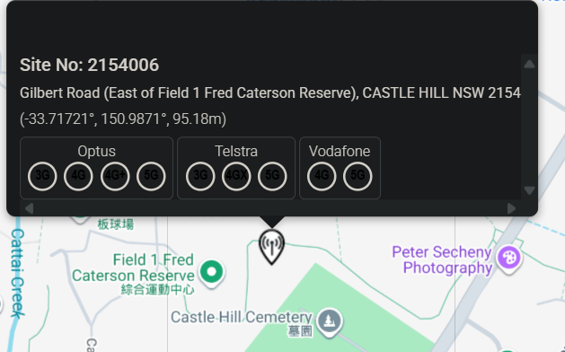
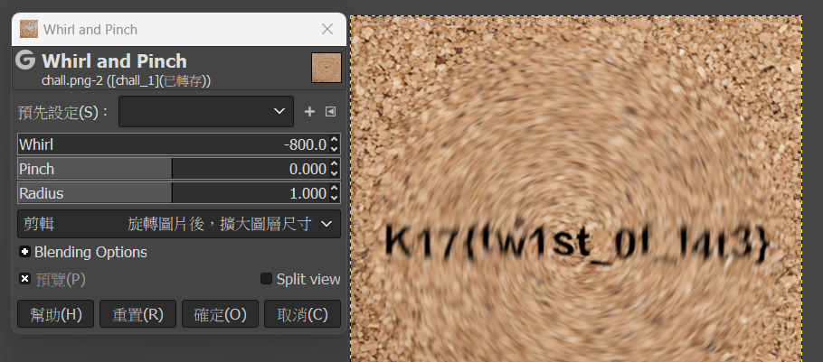
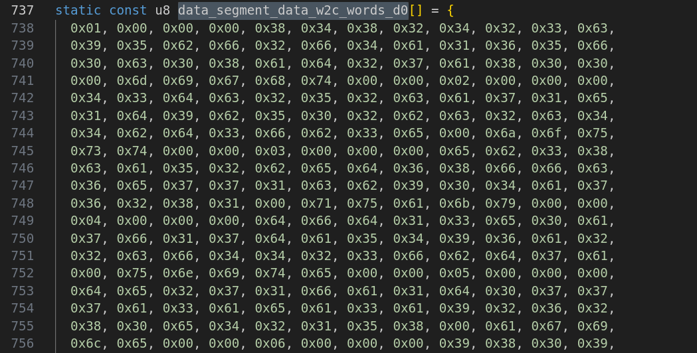
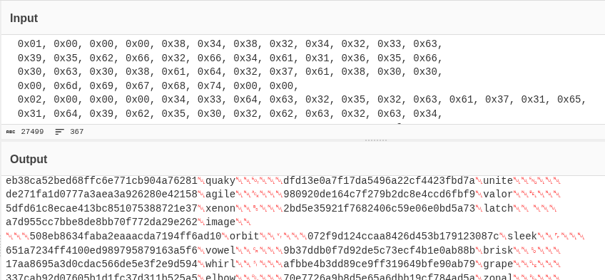
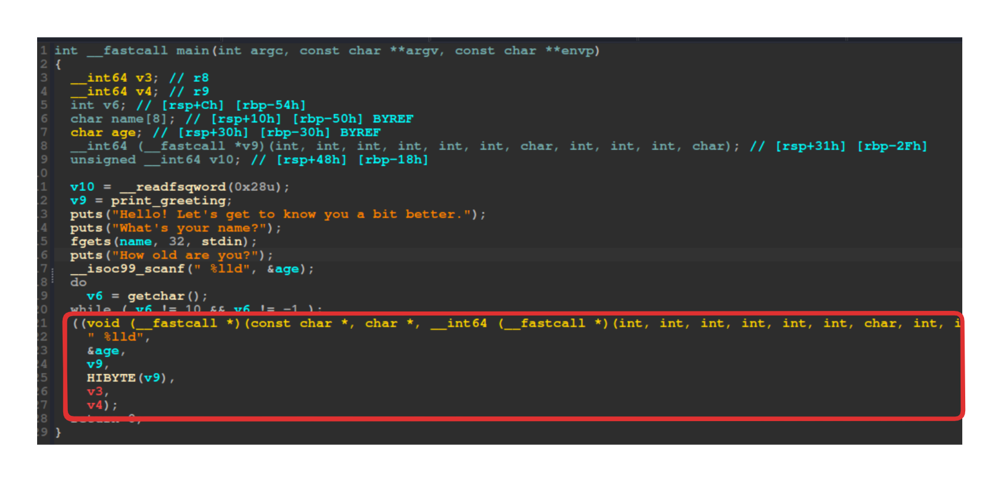
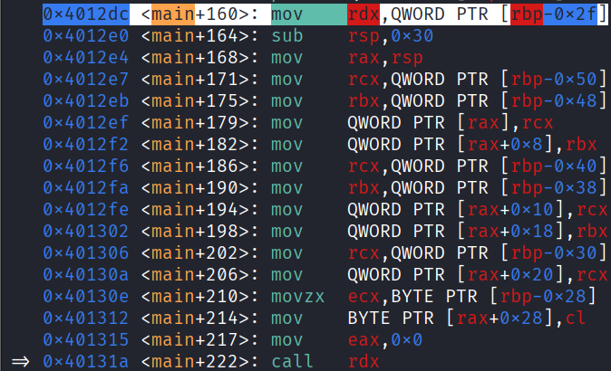
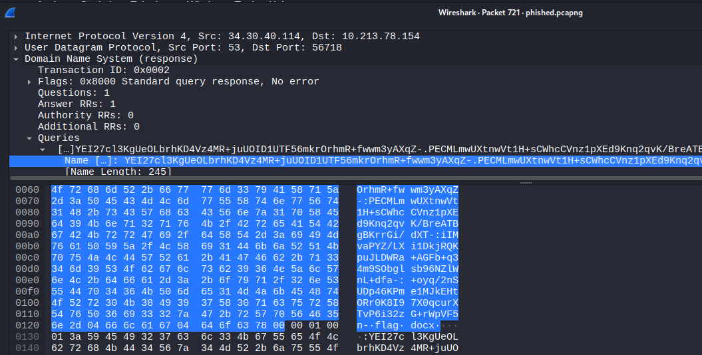

因為我不想寫線性代數的作業所以打了一下 CTF 假裝自己有做點事  


rk: #276 / 972 

## META
### sanity check
Tag: `intro`  

Welcome 題  
flag in rule  

Flag: `K17{we_hop3_y0u_h@ve_Fun}`

---  

### discord
Tag: `intro`  

反正就是 + 個 DC server  
在 `#announcements` 的頻道中  
  

這坨東西看起來很怪對吧  

```
žŸžžŸžŸŸžžŸŸžžžŸžžŸŸžŸŸŸžŸŸŸŸžŸŸžŸŸŸžŸŸŸžŸŸžžŸžŸžŸžžŸŸžžžŸŸžžžŸŸžžŸŸžžžžžŸŸžŸŸžŸžžŸŸžžŸŸžŸžŸŸŸŸŸžŸŸŸžŸžžžžŸŸžžžžžŸžŸŸŸŸŸžŸŸžŸžŸŸžžŸŸžžžŸžžŸŸžŸŸŸžŸžŸŸŸŸŸžŸžžžžŸŸžžŸŸžŸŸŸžŸžžžŸŸžžžŸžžžžŸžžŸžžžžŸžžŸžžžžŸžŸŸŸŸŸžŸ
```

複製丟進 [CyberChef](https://gchq.github.io/CyberChef/#recipe=To_Hex('Space',0)Find_/_Replace(%7B'option':'Regex','string':'9f'%7D,'1',true,false,true,false)Find_/_Replace(%7B'option':'Regex','string':'9e'%7D,'0',true,false,true,false)From_Binary('None',8)&input=np%2Benp%2Ben5%2Benp%2Bfnp6en56en5%2Ben5%2Bfnp%2Bfn5%2Ben5%2Ben5%2Bfnp%2Bfn56fn56en56fnp%2Benp%2Bfnp6en5%2Benp6fn56en5%2Benp6enp%2Bfnp%2Bfnp%2Benp%2Bfnp6fn56fnp%2Bfn5%2Bfnp%2Bfn56fnp6enp%2Bfnp6enp6fnp%2Bfn5%2Bfnp%2Bfnp%2Ben5%2Benp%2Bfnp6en56en5%2Ben5%2Bfnp%2Ben5%2Bfn5%2Ben56enp6fn56en5%2Ben5%2Bfnp%2Benp6fn56enp%2Benp6en56en56enp6fnp6fnp6enp%2Ben5%2Bfn5%2Benw&ieol=CRLF&oeol=CRLF) 轉 hex 看是一堆 `9e` 和 `9f` 組成  
由兩個符號組成的直覺猜摩斯密碼或 binary  
稍微做一下替換就有了  

Flag: `K17{weLc0m3_t0_k17_C7F!!!}`

---

## beginner
### radioactive

Tag: `beginner`, `OSINT`

看圖找地點  
把這個地方的經緯度 round 到小數點後三位就是 flag

  



search on [RFNSA](https://www.rfnsa.com.au/2154006)    



Flag: `K17{-33.717,150.987}`

---

### smoothie
Tag: `beginner`, `misc`  


題目給了一張中間被糊掉的圖片

`strings` 看了一下發現有個 `Q3JlYXRlZCB3aXRoIEdJTVA=` base64 後為 `Created with GIMP`   
那大概知道怎麼回推回去了  
把範圍選好後順時針推回去  


Flag: `K17{tw1st_0f_f4t3}`

---

### daily re
Tag: `beginner`, `rev`, `web`

題目是一個 wordle 遊戲網頁  
而 Flag 是格式為 `K17{<72nd day word>, <73rd day word>, <74th day word>}`  
需要找到 72~74 天的答案  
理所當然開始翻檔案看看有啥  
在 html 中看到了一段

```js
const DAY_NUMBER = 17;
const DAY_KEY = "70e7726a9b8d5e65a6dbb19cf784ad5a";
...
var Module = {
  onRuntimeInitialized: function() {
      let extracted_word = Module.ccall(
          'get_word',
          'string',
          ['number', 'string'],
          [DAY_NUMBER - 1, DAY_KEY]
      )
      if (!extracted_word) {
          console.error("Failed to get word!");
      }
      ...
```

`DAY_NUMBER` 題目有給了 但這個 `DAY_KEY` 看起來是猜不到的  
翻到其他的檔案有個 binary `word.wasm` 看來是該來逆向了

使用 [wabt](https://github.com/WebAssembly/wabt) 中的 `wasm2c`

```bash
wasm2c ./word.wasm -o word.c
```

在 `word.c` 中看到 `data_segment_data_w2c_words_d0[]` 這個 hex array    

丟進 Cyberchef 觀察後發現, 每 44 個 hex 為一天的 `DAY_KEY` 及答案  
可以透過前面看到的 `DAY_KEY` 做驗證  



怎麼可能一個一個算到 72, 倒著算也不太實際  
Time for vibe coding! Script [here](./daily_re.py)


Output:
```
...
Block 72: limbo
Block 73: urban
Block 74: fiber
...
```

Flag: `K17{limbo, urban, fiber}`

---

### pass me the salt
Tag: `beginner`, `crypto`

題目是一個簡單的帳號系統, 目標是以 admin 身分登入  

```py
if not check_login(login, pwd):
    print("Invalid login or password.")
    continue

if login == "admin":
    if pwd != "admin".encode().hex():
        print(f"Congratulations! Here is your flag: {os.getenv("FLAG")}")
```

一開始建立的 admin 為 `create_account("admin", "admin".encode().hex())` 

```py {hl_lines=[5,15]}
def create_account(login, pwd):
    if login in logins.keys():
        return False
    salt = os.urandom(16)
    salted_pwd = salt + (pwd).encode()
    passw = sha1(salted_pwd).hexdigest()
    logins[login] = passw
    salts[login] = salt
    return True

def check_login(login, pwd):
    if login not in logins:
        return False
    salt = salts[login]
    salted_pwd = salt + bytes.fromhex(pwd)
    passw = sha1(salted_pwd).hexdigest()
    return passw == logins[login]
```
`"admin".encode().hex()`為`61646d696e`  
這個密碼的建立與驗證在建立時是 `"61646d696e".encode()`  
但在登入時卻是 `bytes.fromhex(pwd)`  
也就是說輸入的 `pwd` 要使 `"61646d696e".encode()==bytes.fromhex(pwd)`  
那就把 "61646d696e" 轉 hex 就好, 也就是 "36313634366436393665"

script [here](./pass_me_the_salt.py)

Flag: `K17CTF{s4Lt_4nD_p3pper_is_ov3rr4t3d}`

---

### ezwins

chal [here](./ezwin)

簡單說就是題目有給一個輸入數字的地方  
程式會把輸入作為一個位址去呼叫    

加上有一個 `win` 函數 (`0x4011f6`) 可以拿 shell  
所以輸入這個 `win` 的位址十進位格式(`4198902`)就可以了  

以為就這樣而已, 但沒成功  
開 dbg 下去追才發現在呼叫 `0x4011f6` 時只剩下 `0x4011`  
因為在準備呼叫時, 複製這個位址少了一個 byte  

解決也蠻簡單的, 既然 `0x4011f6` 後兩個會不見那就往前推就好  
於是 `0x4011f600` 也就是 1074918912 就是要輸入的值    
script [here](./ezwin.py)  
Flag: `K17{d1dn7_kn0w_u_c0u1d_b3_4ddr355_0f_w1n_m4ny_y34r5_0ld}`

---

# END

`ezwin` 太久沒打 pwn 東西忘光光卡太久啦  
最後在做一題 forensics 要從 pcap 撈檔案出來  
檔案好像是被切塊藏在多個 DNS Query 裡  
  

沒做完時間就到了  


好了該寫線代了
