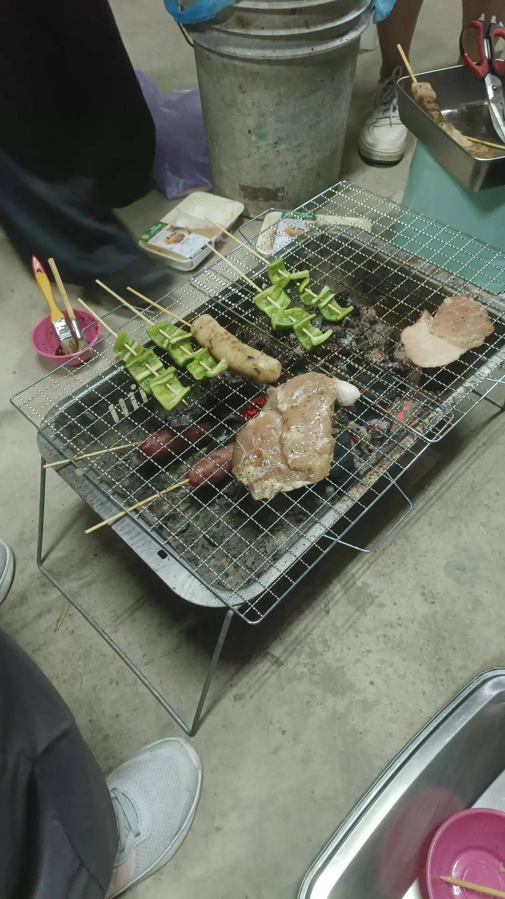
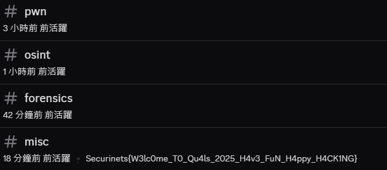
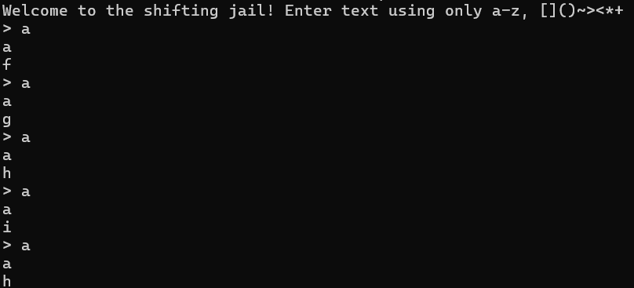
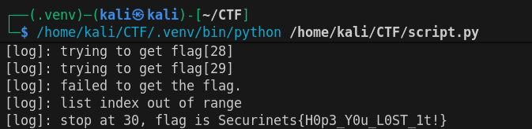


This is post is a translation of <a href="/posts/securinets-ctf-2025/">"Securinets CTF 2025 (zh-tw)</a>.<br>
Not all but some help by Github Copilot use GPT-4o .



team: `nchu_goose`  
rk: #230 / 558

Someone told me to join this event and then said they were busy.  
[@Chao28661](https://ctftime.org/user/218204)  
Strong condemnation...  

# Before start...

This event coincided with the Mid-Autumn Festival, so I was busy barbecuing...  



 Don't ask about those two sausages under the grill. 

# Misc
## Discord

Flag at discord channel `#misc description`  


Flag: `Securinets{W3lc0me_T0_Qu4ls_2025_H4v3_FuN_H4ppy_H4CK1NG}`

## Easy jail

chal file [here](./jail_1.py)

pyjail challenge  
Roughly allows input of a-z, `[]()~><*+`  
The input letters will be randomly replaced.  
Each replacement is different.  
After replacement, it will be passed to `eval` for execution.  

```py {lineNoStart=71}
result = eval(encoded, {"__builtins__": None}, {"flag": flag})
print(result)
```

First, handle the replacement part.  

The challenge kindly does not provide how `shift_mapping` is implemented.  

```py {lineNoStart=26}
def shift_mapping(mapping):
    # well guess how it was done >_<
```

After interacting with the challenge:  
  
It can be seen that  
`shift_mapping` shifts the mapping result randomly forward or backward by one position.  
For example, if `a` maps to `f`, then each `shift_mapping` will shift `f` to `e` or `g`, and then overwrite the original mapping.  
```py
mapping = shift_mapping(mapping)
```

So the implementation of `shift_mapping` might look like this:  

```py
def shift_mapping(mapping):
    shift_table = [-1, 1]
    r = shift_rng.randint(0, 1)
    shift = shift_table[r]
    new_mapping = {}
    for c, v in mapping.items():
        v = ord(v) + shift_table[shift]
        if v < ord('a'):
            v += 26
        elif v > ord('z'):
            v -= 26
        new_mapping[c] = chr(v)
    return new_mapping
```

Select 1 or -1 from a specific random seed.  
Then shift the mapping result forward or backward by one position.  
Cycle through a-z to ensure it doesn't exceed the range of lowercase English letters.  

Since the mapping is random, there are several approaches:  
1. Exhaust all possible random seed results to find a match.  
2. Deduce the seed from a large number of results to predict the next one.  
3. Guess the next mapping shift.  

---

### Exhaustion

The challenge provides the seed range as `0 ~ 2**20`.  
This number seems too large to consider for now.  
maybe this is possible to make it (?)

```py {lineNoStart=4}
seed = random.randint(0, 2**20)
shift_rng = random.Random(seed)
```

### Prediction

The random number used in the challenge is `random.Random`.  
From [doc](https://docs.python.org/zh-tw/3.13/library/random.html), we know Python's `Random` implementation uses the Mersenne Twister algorithm.  
This algorithm can deduce its internal state and predict future outputs if a large number of consecutive outputs are known.  
Refer to [mersenne-twister-predictor](https://github.com/kmyk/mersenne-twister-predictor).  
This project implements an MT19937 predictor.  
As long as there are 624 consecutive 32-bit integer outputs, the internal state can be deduced.  

The problem is:  
In this challenge, we can only observe consecutive 1-bit outputs (1 or -1).  
This means 624 * 32 = 19968 consecutive outputs are needed to deduce the internal state.  
But can 1-bit outputs really predict?  

I tried using the MT19937 predictor from the [mersenne-twister-predictor](https://github.com/kmyk/mersenne-twister-predictor) project, but it didn't seem to work.  
Anyway, I didn't succeed.  
OK, let's move on to the next method.  

### Guessing

Alright, since the first two methods don't seem feasible,  
it's time to use the power of probability  and mysticism .  
The possible mapping shift results are only two: -1 or +1.  
So the probability of guessing correctly is 50%.  
As long as you try enough times, you can guess the next mapping.  

---

### Implementation

Since guessing is required, you need to know where to start guessing.  
This means you need to know which characters a-z currently map to.  
This way, you can guess the next mapping.  
Simply input `abcdefghijklmnopqrstuvwxyz` to find the current mapping.  
Then simulate `shift_mapping` to guess the next mapping.  
Find the string to input so that the result after mapping matches `flag`.  

```py
def find_mapping():
    r.sendline(b"abcdefghijklmnopqrstuvwxyz")
    r.recvline() # echo
    res = r.recvline().strip().decode() # mapping
    mapping = {k: v for k, v in zip(string.ascii_lowercase, res)}
    return mapping
```

Then randomly guess the next mapping.  
If the guess is wrong, reposition the mapping offset for this round based on the returned content and guess again.  

### pyjail
The challenge file shows that the flag type is `ProtectedFlag`.  

```py
class ProtectedFlag:
    def __init__(self, value):
        self._value = value

    def __str__(self):
        return "variable protected, sryy"

    def __repr__(self):
        return "variable protected, sryy"

    def __getitem__(self, index):
        try:
            return self._value[index]
        except Exception:
            return "variable protected, sryy"
```

Both `__str__` and `__repr__` are overridden, so directly printing it is useless.  
Accessing `_value` with `.` is not allowed, and `:` is not provided to print the entire value.  
Therefore, it seems that `flag[index]` must be used to retrieve the flag one character at a time.  
The problem is that the challenge does not allow numeric input.  
Q: How to get the index?  
A: True + True = 2.  

The challenge provides `>` and `<` for comparison to get True or False.  
`[[]]<[]` will be False.  
`[[]]>[]` will be True.  

With `+`, `*`, `<<`, you can construct any number.  

script [here](./jail_2.py)  

  

Flag: `Securinets{H0p3_Y0u_L0ST_1t!}`  

---

## md7

The challenge requires finding 100 pairs of different numbers.  
After performing specific operations, their md5 values must be the same.  

This means finding 100 pairs of numbers such that the results after processing are the same.  
In `generateHash`, it can be seen that:  

```js {{ lineNoStart=25 }}
function generateHash(input) {
  input = input
    .split("")
    .reverse()
    .map(d => ((parseInt(d, 10) + 1) % 10).toString())
    .join("");
    ...
    const normalized = +input; // L43
```

Here, the input string is split into a list and reversed.  
Each character is converted to a number, incremented by 1, mod 10, and converted back to a character.  
Finally, the entire list is joined and converted to a number.  

As long as two different inputs result in strings where one has leading zeros and the other does not, and their values are the same after removing leading zeros, they will match.  
This means finding number pairs like `n` and `n9` where `n` is not 0.  

script [here](./md7.py)  


chatGPT solve this challenge.  
https://chatgpt.com/share/68e52a04-2c2c-8000-baa4-4bdb94a7e0b5  
vibe CTF player again lol


Flag: `Securinets{floats_in_js_xddddd}`

# END

Huh? You ask why there are only 2 challenges?  
I was barbecuing.  
.w.