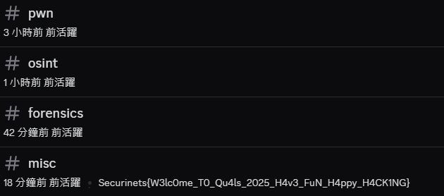

team: `nchu_goose`  
rk: #230 / 558

有人跟我說要打這場然後又跟我說沒空  
[@Chao28661](https://ctftime.org/user/218204)  
嚴厲譴責  

# Before start...

這場時間剛好是中秋節，都在烤肉...  


 別問那兩根在烤網下的香腸是怎麼回事 

# Misc
## Discord

Flag at discord channel `#misc description`


Flag: `Securinets{W3lc0me_T0_Qu4ls_2025_H4v3_FuN_H4ppy_H4CK1NG}`

## Easy jail

chal file [here](./jail_1.py)

pyjail 題  
大概是允許輸入 a-z , `[]()~><*+`  
輸入的英文會被做隨機替換  
每次替換會不同  
替換完會丟到 `eval` 執行  

```py {lineNoStart=71}
result = eval(encoded, {"__builtins__": None}, {"flag": flag})
print(result)
```

先處理替換的部分  

題目很貼心地沒有給`shift_mapping`是怎麼實作   

```py {lineNoStart=26}
def shift_mapping(mapping):
    # well guess how it was done >_<
```

在跟題目做互動後  

可以看出  
`shift_mapping` 做的是把 mapping 後的結果隨機往前後移動一位  
假設 `a` mapping 到 `f` 那麼每次 `shift_mapping` 會把 `f` 偏移成 `e` 或是 `g`, 再覆寫回原本的 mapping  
```py
mapping = shift_mapping(mapping)
```

所以 `shift_mapping` 的實作可能是這樣  

```py
def shift_mapping(mapping):
    shift_table = [-1, 1]
    r = shift_rng.randint(0, 1)
    shift = shift_table[r]
    new_mapping = {}
    for c, v in mapping.items():
        v = ord(v) + shift_table[shift]
        if v < ord('a'):
            v += 26
        elif v > ord('z'):
            v -= 26
        new_mapping[c] = chr(v)
    return new_mapping
```

從特定種子的隨機數選出 1 或 -1 
然後把 mapping 的結果往前或後移動一位  
然後循環 a-z 不讓他超出英文小寫的範圍  

既然 mapping 是隨機的  
那麼可以有幾個方向  
1. 窮舉所有可能的隨機種子結果找相符的
2. 從大量結果回推出 seed 預測出下一個
3. 猜下一次的 mapping 位移  

---

### 窮舉

題目有給 seed 的範圍在 `0 ~ 2**20`  
這個數字我覺得太大先不考慮  
也許其實是可以做的 (?)

```py {lineNoStart=4}
seed = random.randint(0, 2**20)
shift_rng = random.Random(seed)
```

### 預測

題目的隨機數使用的是 `random.Random`  
> Python 使用 Mersenne Twister（梅森旋轉演算法）作為核心的產生器  
by [Python doc](https://docs.python.org/zh-tw/3.13/library/random.html)  

而這個演算法在知道大量連續的輸出時，可以回推內部狀態，進而預測未來的輸出  
可以參考 [mersenne-twister-predictor](https://github.com/kmyk/mersenne-twister-predictor)  
這個專案實作了 MT19937 的預測器  
只要有連續 624 個 32-bit 整數的輸出就可以回推內部狀態  

問題是  
在這個題目我們能觀察到的只有連續的 1 或 -1 相當於 1-bit 的輸出  
也就是說需要 624 * 32 = 19968 個連續的輸出才能回推內部狀態  
但只有 1-bit 的輸出 真的能預測嗎 ?  

我自己使用前面提到的 [mersenne-twister-predictor](https://github.com/kmyk/mersenne-twister-predictor) 這個專案實作的 MT19937 的預測器，看起來好像不行(?)  
反正我是沒有做成功  
下面一位~  

### 猜

好的 既然前兩個方法看起來都不太行  
那麼是時候用上機率玄學的力量了  
mapping 可能的位移結果只有兩種 -1 或 +1  
所以猜對的機率是 50%  
只要嘗試得夠多次就能猜到下一次的 mapping 是甚麼  

---

### 實作

既然要猜 也要知道從哪裡開始猜  
也就是說需要先知道目前 a-z 分別 mapping 到哪個字元  
這樣才能猜下一次的 mapping 是甚麼  
只需要輸入 `abcdefghijklmnopqrstuvwxyz` 得知目前的 mapping  
再模擬 `shift_mapping` 猜下一次的 mapping  
找出要讓輸入 mapping 後的結果為 `flag` 需要輸入的字串

```py
def find_mapping():
    r.sendline(b"abcdefghijklmnopqrstuvwxyz")
    r.recvline() # echo
    res = r.recvline().strip().decode() # mapping
    mapping = {k: v for k, v in zip(string.ascii_lowercase, res)}
    return mapping
```

然後隨機猜下一次的 mapping  
如果猜錯了就根據回傳內容重新定位這一輪的 mapping 偏移量再猜一次  

### pyjail  
題目給的檔案可以看到 flag 的型別是 `ProtectedFlag`  

```py
class ProtectedFlag:
    def __init__(self, value):
        self._value = value

    def __str__(self):
        return "variable protected, sryy"

    def __repr__(self):
        return "variable protected, sryy"

    def __getitem__(self, index):
        try:
            return self._value[index]
        except Exception:
            return "variable protected, sryy"
```

`__str__` 和 `__repr__` 都被覆寫了，直接印出來並沒有用  
也不允許 `.` 來存取 `_value`, 也沒有`:`可以整個印出來  
因此看起來是要用 `flag[index]` 來一個一個字元拿出來  
問題是題目並不允許輸入數字  
Q: 那怎麼得到 index ?  
A: True + True = 2  

題目有給 `>` 和 `<` 可以用來比較拿到 True 或 False  
`[[]]<[]` 會是 False  
`[[]]>[]` 會是 True  

再加上 `+`, `*`, `<<` 就可以組合出任意的數字  

script [here](./jail_2.py)  

  

Flag: `Securinets{H0p3_Y0u_L0ST_1t!}`  

---

### md7

題目要找 100 組不同的數字  
並且在做特定操作後的 md5 值要相同  

也就是說找 100 組數字做操作後的結果要相同  
在 `generateHash` 中可以看到

```js {{ lineNoStart=25 }}
function generateHash(input) {
  input = input
    .split("")
    .reverse()
    .map(d => ((parseInt(d, 10) + 1) % 10).toString())
    .join("");
    ...
    const normalized = +input; // L43
```

這邊會把輸入的字串分成 list 做反轉  
然後每個字元轉成數字加 1 後 mod 10  再轉回字元  
最後再把整個 list join 後轉成數字

只要兩個不同的輸入，經過處理之後得到的字串一個有前導零、另一個沒有，去掉前導零後數值一樣  
也就是找 `n` 跟 `n9` 且 `n` 不為 0 這種數字組合

script [here](./md7.py)


chatGPT solve this challenge.    
https://chatgpt.com/share/68e52a04-2c2c-8000-baa4-4bdb94a7e0b5  
vibe CTF player again lol


Flag: `Securinets{floats_in_js_xddddd}`

# END

蛤 ? 你問我怎麼只有 2 題 ?  
我在烤肉阿 .w.
