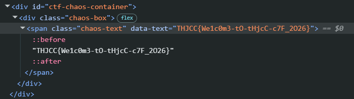
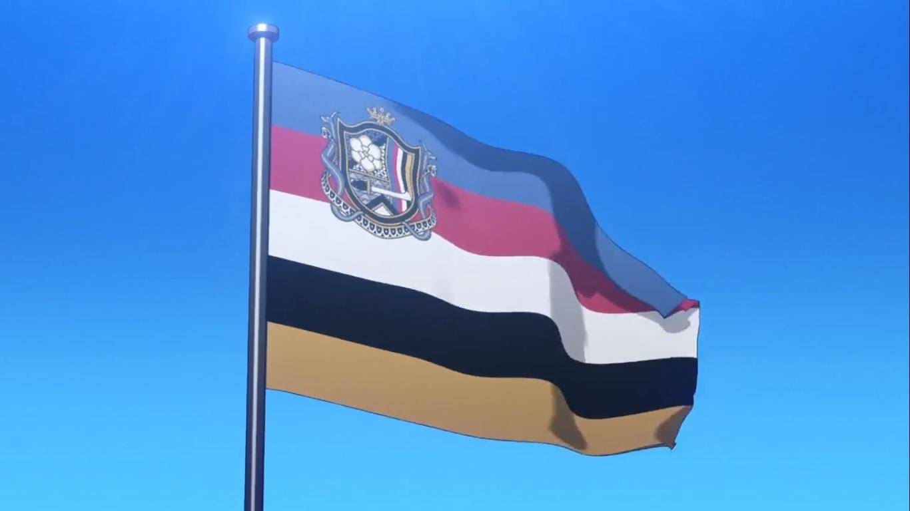
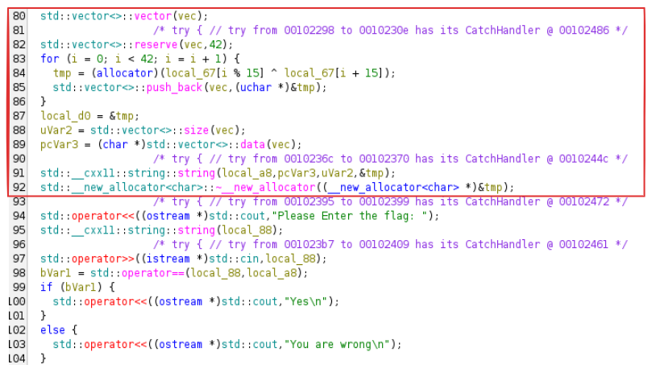
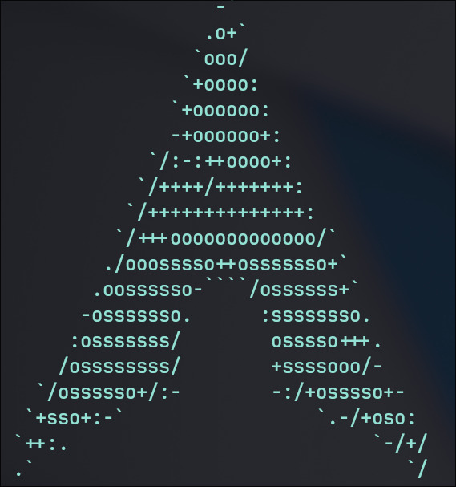

好忙好忙沒認真打 = =  
然後就 #189th 

## Welcome
### Welcome to THJCC CTF

Just F12.



---

## Reverse
### Super baby reverse
> My first C lang project can you find the hidden message inside?
> 
[THJCC_Super_Baby_Reverse](./chal/Super_baby_reverse/THJCC_Super_Baby_Reverse)

```sh
> strings ./chal

...
THJCC{BaH
BY_r3v3rH
s3_f0r_bH
eggin3r}H
...
```

然後把後綴的 H 去掉就得到 flag 了。

Flag: `THJCC{BaBY_r3v3rs3_f0r_beggin3r}`

---

### Fllllllag_ch3cker_again?
> Flag chekcer again?????????
> 
[chal](./chal/Fllllllag_ch3cker_again/chal)


在 Ghidra 打開後可以看到  
  
可以看到有做 XOR 把 flag 算出來後再跟輸入的 flag 做比較。  
所以只要撈出 `local_67` 的內容做一樣的運算即可  

[script.py](./chal/Fllllllag_ch3cker_again/script.py)

Flag: `THJCC{A_Simpl3_R3v3r3_using_CPP_d0ing_X0R}`

---

## Misc
### IMAGE?
> Check the hex of this image
> 

嘗試用 [hexed.it](https://hexed.it/) 打開後沒發現什麼有趣的  
改用 exiftool  
```sh
$ exiftool ./THJCC_IMAGE.png 
ExifTool Version Number         : 13.25
File Name                       : THJCC_IMAGE.png
Directory                       : .
File Size                       : 8.6 MB
...
Warning                         : [minor] Trailer data after PNG IEND chunk
Image Size                      : 1920x1080
Megapixels                      : 2.1
```
一張 1920x1080 的圖片有這麼大嗎? 另外在 PNG 結尾還有資料 ?  
用 binwalk 拆開 發現裡面有另一張圖片  
```sh
$ binwalk ./THJCC_IMAGE.png 

DECIMAL       HEXADECIMAL     DESCRIPTION
--------------------------------------------------------------------------------
0             0x0             PNG image, 1920 x 1080, 8-bit/color RGBA, non-interlaced
2378970       0x244CDA        JBOOT STAG header, image id: 7, timestamp 0xDFB3B257, image size: 3783069087 bytes, image JBOOT checksum: 0x39CF, header JBOOT checksum: 0x6C5B
3297649       0x325171        Zip archive data, at least v1.0 to extract, name: cute/
3297712       0x3251B0        Zip archive data, at least v2.0 to extract, compressed size: 3295808, uncompressed size: 3297649, name: cute/F.png
6593588       0x649C34        Zip archive data, at least v2.0 to extract, compressed size: 2009795, uncompressed size: 2009485, name: cute/F3.png
8603688       0x834828        End of Zip archive, footer length: 22
```


Flag: `THJCC{fRierEN-SO_cUTe:)}`

---

## Forensics
### Ransomware
> Ransomware?  
> [THJCC_Ransomware.zip](./chal/THJCC_Ransomware.zip)

檔案解壓縮後有多個檔案

```sh
$  tree
.
├── calc.lnk
├── Discord.lnk
├── flag.txt.lock
├── Google Chrome.lnk
├── LINE.lnk
└── Uto.jpg
```

其中 `flag.txt.lock` 應該是加密過的 flag，所以剩下的應該有加密方式。  

  
使用文字打開這張圖後在最後面找到加密方式  
```ps1
$InputFile  = Join-Path -Path (Get-Location) -ChildPath 'flag.txt'
$OutputFile = "$InputFile.lock"

if (-not (Test-Path -LiteralPath $InputFile -PathType Leaf)) {
  throw "找不到檔案：$InputFile"
}

$UnixTime = [DateTimeOffset]::UtcNow.ToUnixTimeSeconds()

# key = MD5( UnixTimeSeconds as UTF-8 string ) -> 16 bytes (AES-128)
$md5 = [System.Security.Cryptography.MD5]::Create()
try {
  $keyMaterial = [Text.Encoding]::UTF8.GetBytes([string]$UnixTime)
  $Key = $md5.ComputeHash($keyMaterial)
} finally {
  $md5.Dispose()
}

# AES-CBC PKCS7
$AES = [System.Security.Cryptography.Aes]::Create()
$AES.Mode    = [System.Security.Cryptography.CipherMode]::CBC
$AES.Padding = [System.Security.Cryptography.PaddingMode]::PKCS7
$AES.Key     = $Key
$AES.GenerateIV()

$in  = [IO.File]::OpenRead($InputFile)
$out = [IO.File]::Create($OutputFile)

try {
  $unixBytes = [BitConverter]::GetBytes([int64]$UnixTime)
  $out.Write($unixBytes, 0, $unixBytes.Length)
  $out.Write($AES.IV, 0, $AES.IV.Length)

  $enc = $AES.CreateEncryptor()
  $crypto = New-Object System.Security.Cryptography.CryptoStream(
    $out, $enc, [System.Security.Cryptography.CryptoStreamMode]::Write
  )
  try {
    $in.CopyTo($crypto)
  } finally {
    $crypto.FlushFinalBlock()
    $crypto.Dispose()
  }
}
finally {
  $in.Dispose()
  $out.Dispose()
  $AES.Dispose()
  [Array]::Clear($Key, 0, $Key.Length)
}

Remove-Item -LiteralPath $InputFile -Force
```

直接讓 AI 寫解密腳本  
[decrypt](./solve/Ransomware/decrypt.ps1)

Flag: `THJCC{L1nK_R4Ns0mWar3_😭😭😭😭}`

---

### I use arch btw
> Can you find the hidden message?  
> > Author: UmmIt Kin



用 binwalk 拆開後有一個有密碼的 xlsx  
用 office2john + john 破解得到密碼 `rush2112`

Flag: `THJCC{7h15_15_7h3_m3554g3....._1_u53_4rch_b7w}`

---

## Web
### Las Vegas

> Lucky 7 7 7  
> )
> >Ahthor: Frank  
> http://chal.thjcc.org:14514

看來有人出題打錯字  

打開題目給的網址後在 html 的地方可以看到有這麼一段 js  
```js
btn.onclick = function() {
    btn.disabled = true;
    let digits = [0,0,0];
    let count = 0;

    interval = setInterval(() => {
        for (let i = 0; i < 3; i++) {
            digits[i] = getRandomDigit();
        }
        slot.textContent = digits.join(' ');
        count++;

        if(count > 20){
            clearInterval(interval);
            const n = digits.join('');
            fetch("/?n=" + n, {method: "POST"})
                .then(resp => resp.text())
                .then(txt => {
                    message.innerHTML = txt;
                    btn.disabled = false;
                });
        }
    }, 100);
};
```

可以注意到有個向 `/?n=` 發送 POST 請求的地方，裡面會帶上三個數字。  
用 curl 發送 777 看看  
```sh
$ curl -X POST "http://chal.thjcc.org:14514/?n=777"
What a Lucky man! THJCC{LUcKy_sEVen_41a913a5730fe468}
```

Flag: `THJCC{LUcKy_sEVen_3061f8368b364ddf}`

---

## END
