 
Team: `nchu_goose`  
Teammate: [@chen](https://ctftime.org/user/207624) [@Chao28661](https://ctftime.org/user/218204)

rk. #409 / 1376

## Misc
### Tribble with my Skin

> My Minecraft account got hacked and now my skin seems to be a little off...  
> Mind checking it out? My Minecraft username is "oatzs".

很明顯題目跟 `oatzs` 這個 ID 的 Minecraft 帳號皮膚有關  
可以在 [skinmc.net](https://skinmc.net/profile/oatzs.1) 查看這位玩家的皮膚  

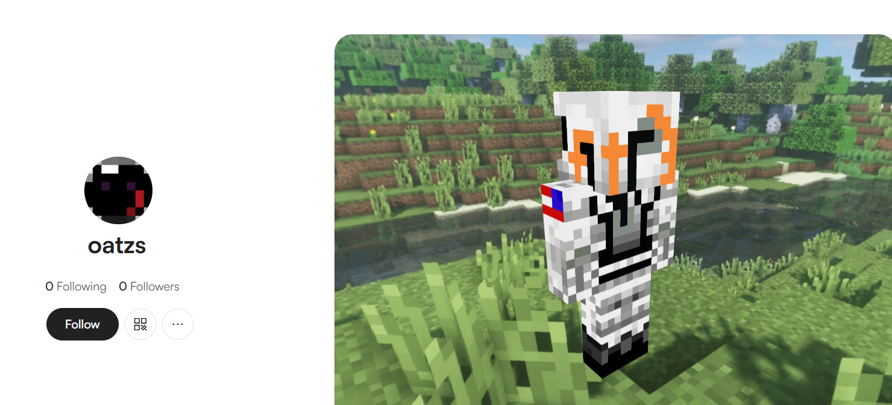

打開線上的編輯器可以看到

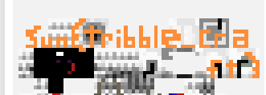  

Flag: `sun{tribble_craft}`

---

### BigMak

> I tried typing out the flag for you, but our Astronaut **Cole**son seems to have changed the terminal's keyboard layout? He went out to get a big **mak** so I guess we're screwed. Whatever, here's the flag, if you can somehow get it back to normal.  
> rlk{blpdfp_iajylg_iyi}

題目有使用粗體標出了提示 `Colemak` 
Colemak 是一種鍵盤配置方式，將字母重新排列

也就是說題目給的 flag 是使用 Colemak 配置打出來的  
只要對照鍵位表將字母轉回一般的即可

Flag: `sun{burger_layout_lol}`

---

## Web
### Lunar Auth

題目進來頁面沒甚麼資訊 但提到了**no robots are allowed**

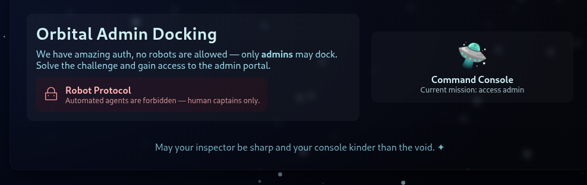

看一下 `robots.txt`  
```
# tired of these annoying search engine bots scraping the admin panel page logins:

Disallow: /admin
```

看起來正常的登入介面  
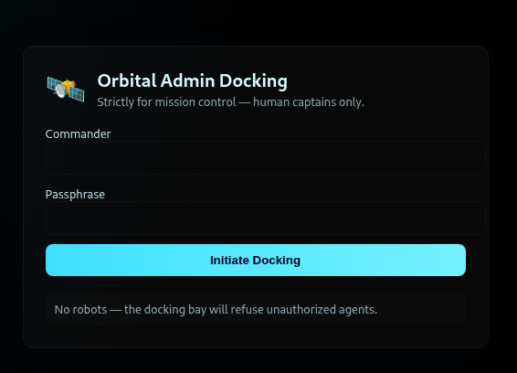

前端驗證
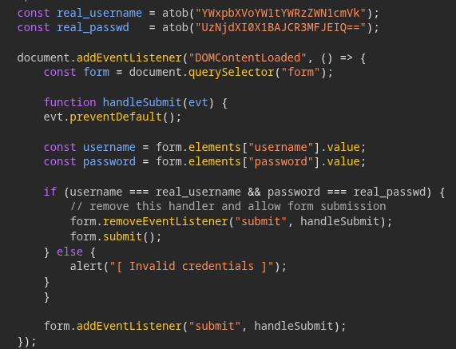

Flag: `sun{cl1ent_s1d3_auth_1s_N3V3R_a_g00d_1d3A_983765367890393232}`

---

### Lunar Shop

題目看起來是一個清單顯示販售物品  
觀察網址可以發現有 `product_id` 的參數  
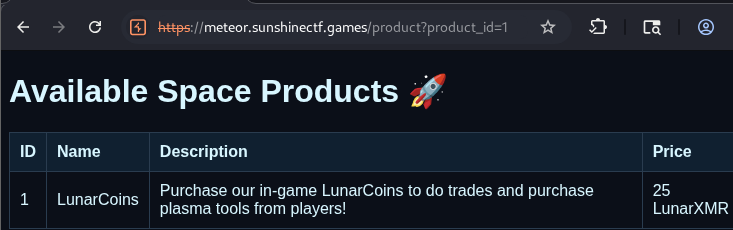  

可以戳出 Error
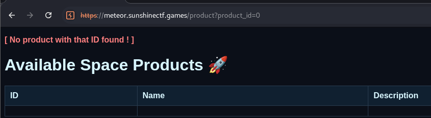  

然後開始試 UNION base SQL Injection 有 4 個 column  
猜使用的是 SQLite 所以戳 `sqlite_master` 來看有哪些 table 及 schema
```sql
UNION SELECT NULL, name, sql, NULL FROM sqlite_master WHERE type='table'  
```

就可以知道怎麼拿 flag 了

```sql
UNION SELECT NULL, NULL, flag, NULL FROM flag 
```

Flag: `sun{baby_SQL_injection_this_is_known_as_error_based_SQL_injection_8767289082762892}`

---

## Forensics
### Pretty Delicious Food

題目給了一個 [pdf 檔](./prettydeliciouscakes.pdf) 直接先 `strings` 跟 `binwalk`  

`strings` 沒看到甚麼有趣的  
```
$ binwalk ./prettydeliciouscakes.pdf             

DECIMAL       HEXADECIMAL     DESCRIPTION
--------------------------------------------------------------------------------
0             0x0             PDF document, version: "1.4"
1500          0x5DC           Zlib compressed data, default compression
1630          0x65E           Zlib compressed data, default compression
2259          0x8D3           Zlib compressed data, default compression
2016258       0x1EC402        Zlib compressed data, default compression
2016664       0x1EC598        Zlib compressed data, default compression
4380767       0x42D85F        Zlib compressed data, default compression
4381068       0x42D98C        Zlib compressed data, default compression
4381993       0x42DD29        Zlib compressed data, default compression
```

拆出來 `0x5DC` 有一個文字檔
```js
const data = 'c3Vue3AzM3BfZDFzX2ZsQGdfeTAhfQ==';
```

長的就一臉 Base64 的樣子

Flag: `sun{p33p_d1s_fl@g_y0!}`

---

### t0le t0le
題目給了一個 [word 檔](t0le.docx)  
`binwalk` 拆出來看到一個 `.bin` 的檔案覺得怪怪的進去翻  

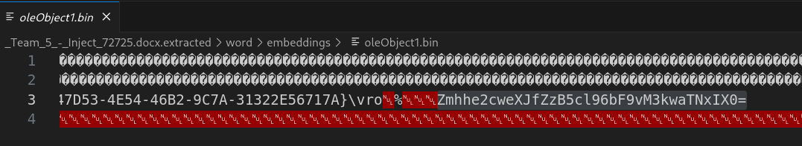  

看到 `=` 結尾都想戳一下 base64
進 CyberChef 解完是`fha{g0yr_g0yr_zl_o3y0i3q!}`很像 flag 的形狀了  
猜 rot13 就有 flag 了

Flag: `sun{t0le_t0le_my_b3l0v3d!}`

---

### Intergalactic Copyright Infringement

題目給一個 [evidence.pcapng](evidence.pcapng) 用 Wireshark 開起來  
有一堆 BitTorrent 的封包  
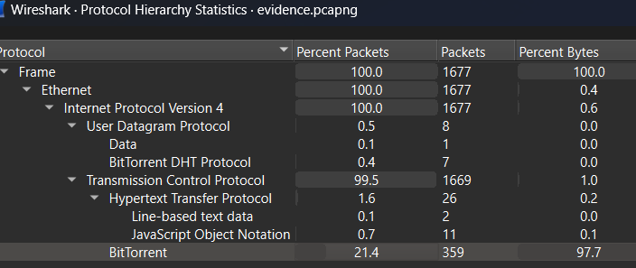  
猜是從這些封包裡面撈檔案找  
但 Wireshark 好像不能直接 export objects for bittorrent (至少我沒看到)  
於是開始出一張嘴詠唱  

Model: Claude Sonnet 4
Prompt:  
```
i have a #file:evidence.pcapng contain some bittorrent connection data, how to get the bittorrent content
```

在一堆檔案裡翻到一個 jpg 

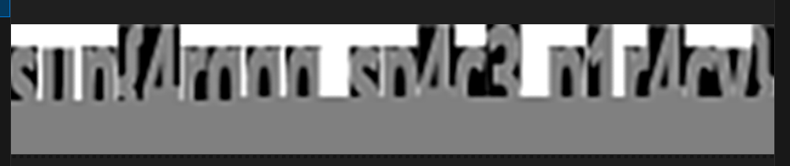  
(這是一張截圖)

可以發現這是 flag 的形狀沒錯 但有一半消失了  
也就是說 Claude 沒把 script 寫好(?)  
Claude: 你行你上  
換個模型(GPT-5)試試看  
既然知道是圖片就改一下 Prompt  
讓他 focus 在圖片上  
最後得到

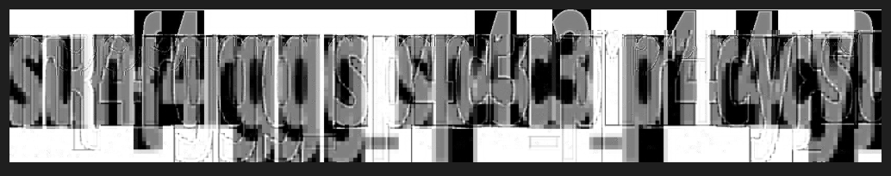  

雖然還是很醜但已經可以看出 flag 了  

script [here](./extract_images.py)

Flag: `sun{4rggg_sp4c3_p1r4cy}`

---

## Rev

### BASEic

進 ida decompile 看到兩個可以字串  
其中一個還是 `=` 結尾  
撿起來丟進 CyberChef 解 Base64

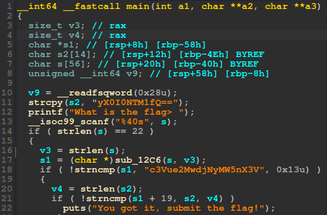  

Flag: `sun{c0v3r1ng_ur_B4535}`

---

### Palatine Pack

chal files: [flag.txt](./flag.txt), [palatine_pack](./palatinepack)  

給一個執行檔跟輸出的結果  
逆著做回去就好  

蛤? 你問我怎麼逆的?  
我不會阿 .w.  

就丟進 ida decompile 完發現看不懂, 轉頭把重點 function 丟給 GPT-5   

然後我就得到 [reverse_main.py](./reverse_main.py)  
執行完就有flag了  

Flag: `sunshine{C3A5ER_CR055ED_TH3_RUB1C0N}`

btw 最後 10 分鐘才點進這題 倒數一分鐘送出 flag  
vibe CTF player lol

---

## END
