
This is post is a translation of <a href="/posts/sunshinectf2025/">SunshineCTF 2025 Writeup (zh-tw)</a>.<br>
Translate by Github Copilot use GPT-4.1 .


Team: `nchu_goose`  
Teammates: [@chen](https://ctftime.org/user/207624) [@Chao28661](https://ctftime.org/user/218204)

Rank: #409 / 1376

## Misc
### Tribble with my Skin

> My Minecraft account got hacked and now my skin seems to be a little off...  
> Mind checking it out? My Minecraft username is "oatzs".

It’s obvious the challenge is about the Minecraft skin of the account `oatzs`.  
You can view this player’s skin on [skinmc.net](https://skinmc.net/profile/oatzs.1).

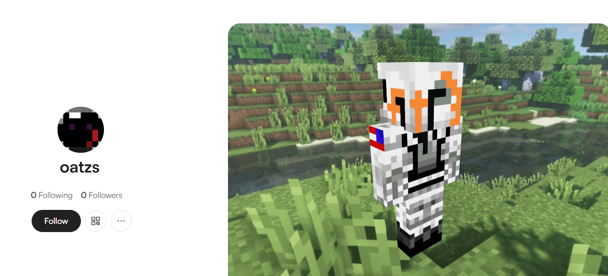

Open the online editor and you can see:

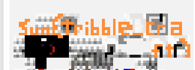  

Flag: `sun{tribble_craft}`

---

### BigMak

> I tried typing out the flag for you, but our Astronaut **Cole**son seems to have changed the terminal's keyboard layout? He went out to get a big **mak** so I guess we're screwed. Whatever, here's the flag, if you can somehow get it back to normal.  
> rlk{blpdfp_iajylg_iyi}

The prompt bolds the hint `Colemak`.  
Colemak is a keyboard layout with different key positions.

That means the given flag was typed using the Colemak layout.  
Just map the letters back to QWERTY to recover it.

Flag: `sun{burger_layout_lol}`

---

## Web
### Lunar Auth

The landing page doesn’t show much, but it mentions **no robots are allowed**.


Check `robots.txt`:
```
# tired of these annoying search engine bots scraping the admin panel page logins:

Disallow: /admin
```

Looks like a normal login page.  
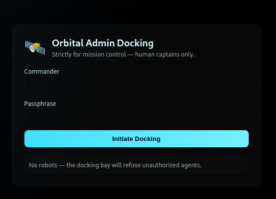

Client-side validation:  
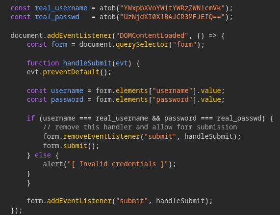

Flag: `sun{cl1ent_s1d3_auth_1s_N3V3R_a_g00d_1d3A_983765367890393232}`

---

### Lunar Shop

This looks like a storefront listing items.  
The URL contains a `product_id` parameter.  
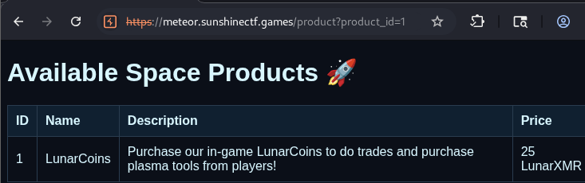  

You can trigger an error:  
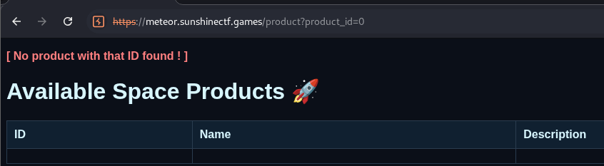  

Then try UNION-based SQL injection; there are 4 columns.  
I guessed it was SQLite, so I queried `sqlite_master` to enumerate tables and schema:
```sql
UNION SELECT NULL, name, sql, NULL FROM sqlite_master WHERE type='table'  
```

From there it’s straightforward to pull the flag:
```sql
UNION SELECT NULL, NULL, flag, NULL FROM flag 
```

Flag: `sun{baby_SQL_injection_this_is_known_as_error_based_SQL_injection_8767289082762892}`

---

## Forensics
### Pretty Delicious Food

Given a [pdf](./prettydeliciouscakes.pdf). I ran `strings` and `binwalk`.

`strings` didn’t show anything interesting.
```
$ binwalk ./prettydeliciouscakes.pdf             

DECIMAL       HEXADECIMAL     DESCRIPTION
--------------------------------------------------------------------------------
0             0x0             PDF document, version: "1.4"
1500          0x5DC           Zlib compressed data, default compression
1630          0x65E           Zlib compressed data, default compression
2259          0x8D3           Zlib compressed data, default compression
2016258       0x1EC402        Zlib compressed data, default compression
2016664       0x1EC598        Zlib compressed data, default compression
4380767       0x42D85F        Zlib compressed data, default compression
4381068       0x42D98C        Zlib compressed data, default compression
4381993       0x42DD29        Zlib compressed data, default compression
```

Extracting the blob at `0x5DC` gives a text file:
```js
const data = 'c3Vue3AzM3BfZDFzX2ZsQGdfeTAhfQ==';
```

Looks very much like Base64.

Flag: `sun{p33p_d1s_fl@g_y0!}`

---

### t0le t0le

Given a [Word doc](t0le.docx).  
`binwalk` showed a `.bin` file inside, which looked suspicious, so I dug in.

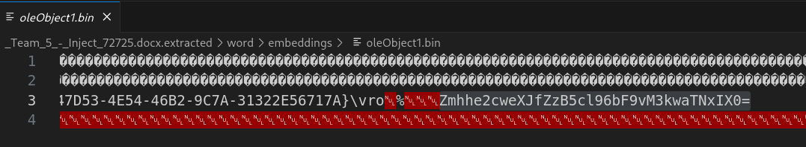  

Since it ends with `=`, I tried Base64 in CyberChef.  
The result was `fha{g0yr_g0yr_zl_o3y0i3q!}`, which looks like a flag.  
Guessing ROT13 yields the flag.

Flag: `sun{t0le_t0le_my_b3l0v3d!}`

---

### Intergalactic Copyright Infringement

Given a [evidence.pcapng](evidence.pcapng) and opened it in Wireshark.  
There are a lot of BitTorrent packets.  
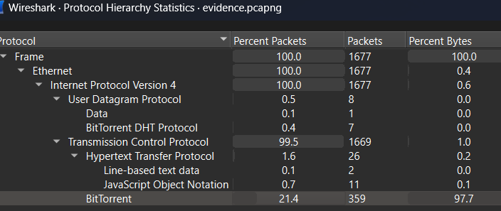  
I assumed we needed to reconstruct files from these packets.  
Wireshark doesn’t seem to directly export objects for BitTorrent (at least I didn’t find it),  
and i don't know how to do it manually,
so I started casting spells with an LLM.

Model: Claude Sonnet 4  
Prompt:  
```
i have a #file:evidence.pcapng contain some bittorrent connection data, how to get the bittorrent content
```

After execute the script provided by Claude,
Among the recovered files I found a JPG:

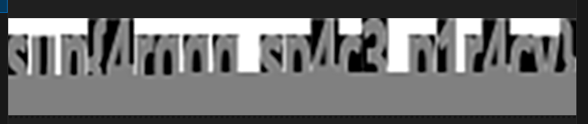  
(This is a screenshot.)

It’s clearly flag-shaped, but half of it is missing — looks like Claude’s script wasn’t robust.  
Claude: “If you think you can do better, go ahead.”  
Switched to another model (GPT-5) and adjusted the prompt to focus on images.  
Finally got this:

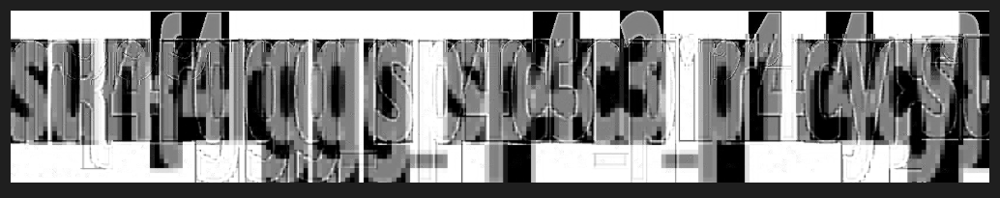  

It’s still ugly, but the flag is legible.  

script [here](./extract_images.py)

Flag: `sun{4rggg_sp4c3_p1r4cy}`

---

## Rev

### BASEic

Decompiled in IDA and saw two strings; one of them ends with `=`.  
Threw it into CyberChef and decoded Base64.

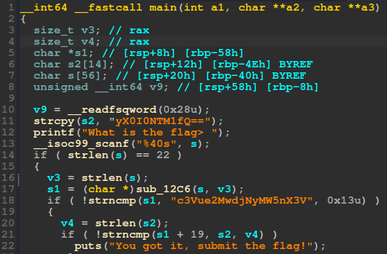  

Flag: `sun{c0v3r1ng_ur_B4535}`

---

### Palatine Pack

chal files: [flag.txt](./flag.txt), [palatine_pack](./palatinepack)  

A binary and an output file were provided. Just reverse the process.  
How did I reverse it? I didn’t — I tried IDA decompile but couldn’t make sense of it,  
so I fed the key function to GPT-5.

Then I got [reverse_main.py](./reverse_main.py).  
Running it yields the flag.

Flag: `sunshine{C3A5ER_CR055ED_TH3_RUB1C0N}`

BTW I only opened this challenge in the last 10 minutes and submitted with one minute left.  
vibe CTF player lol

---

## END
