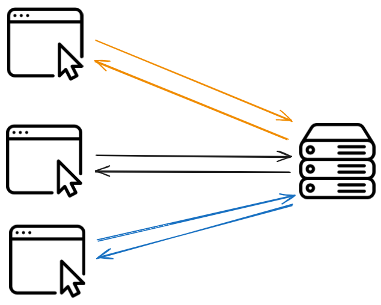
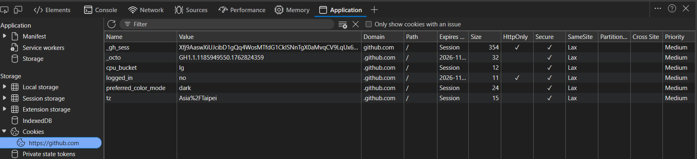
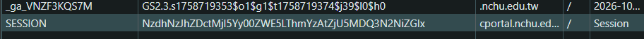

+++
weight = 40
+++

{}

# Web ?

---

## Web

{}
{}
### Frontend

- HTML
- CSS
- JavaScript
{}

{}
### Backend

- Express
- Flask
- ...
{}

{}

---

## <code>What happened when you visit a website?</code>

---

### <code>URL Structure</code>

---

```text
https://github.com/alex/what-happens-when?tab=readme-ov-file#parse-url
```

<ul>
<li class="fragment">Protocol: <code>https://</code></li>
<li class="fragment">Domain: <code>github.com</code></li>
<li class="fragment">Path: <code>/alex/what-happens-when</code></li>
<li class="fragment">Query: <code>?tab=readme-ov-file</code></li>
<li class="fragment">Fragment: <code>#parse-url</code></li>
</ul>

---

### DNS

<span class="fragment">Domain Name System</span>  
<span class="fragment">將網域名稱轉換為 IP 位址</span>  
<span class="fragment">ex. <code>hlc23.dev</code> → <code>172.67.141.200</code></span>

---


---

Not only ASCII...  
ex. [貓.tw](https://貓.tw)  
ex. [中文.台灣](https://中文.台灣)  
ex. [ₕⓁＣ㉓.Ⅾ㋎](https://ₕⓁＣ㉓.Ⅾ㋎)

<span class="fragment">[Domain Obfuscator](https://splitline.github.io/domain-obfuscator/)</span>

{}

---

{}

## <code>HTTP Protocol</code>

---




---

### Request & Response

---

```http
GET / HTTP/1.1\r\n
Host: hlc23.dev\r\n
Accept-Language: en-US\r\n
User-Agent: Mozilla/5.0 (Windows NT 10.0; Win64; x64) ...\r\n
Accept: text/html,application/xhtml+xml...\r\n
Accept-Encoding: gzip, deflate, br\r\n
Connection: keep-alive\r\n
```

`\r\n`: HTTP 使用 CR(`\r`) LF(`\n`) 換行

---

```http
HTTP/2 200 OK
Date: Mon, 10 Nov 2025 20:47:20 GMT
Content-Type: text/html; charset=utf-8
Server: cloudflare
Access-Control-Allow-Origin: *
Strict-Transport-Security: max-age=31556952
Expires: Mon, 10 Nov 2025 20:57:12 GMT
Cache-Control: max-age=600
X-Github-Request-Id: 7664:2742AD:DD4AA7:E6D2B9:69124F4F
Via: 1.1 varnish
X-Served-By: cache-bur-kbur8200166-BUR
X-Cache: HIT
X-Fastly-Request-Id: 8996d4ff2da4a5739b87094df59a0120695e76c0
Cf-Cache-Status: DYNAMIC
Cf-Ray: 99c8678b8f4f4711-LAX

<!doctype html>...
```

{}
Access-Control-Allow-Origin 允許任何來源存取資源(CORS)  
Strict-Transport-Security 強制使用 HTTPS 連線(HTTP HSTS)  
{}

---

### Request Methods

- GET
- POST
- <span style="color:yellow" class="fragment">OPTIONS</span>
- ...

---

[what-happens-when](https://github.com/alex/what-happens-when)

---





<span class="fragment">HTTP is stateless</span>  
<span class="fragment">怎麼知道哪些請求來自同一個使用者</span>

{}

---

{}

## Cookies & Sessions

---

### Cookies

- 🍪
- 儲存在瀏覽器端的小型文字檔
- Set by server via <span style="color:#ffff00">Set-Cookie</span> header

---



---

- Name=Value
- Expires / Max-Age
- Domain
- Path
- <span style="color:#ffff00">Secure</span>
- <span style="color:#ffff00">HttpOnly</span>
- <span style="color:#ffff00">SameSite</span>

{}

- HttpOnly-無法在 JavaScript 中利用 document.cookie 取得  
- Secure-只有在透過 https:// 傳輸時才會被送出到伺服器  
- Expires=<date>-cookie 會在設定的日期與時間之後失效  
    -沒設定則會在瀏覽器關閉後自動失效  
-Max-Age=<seconds>-cookie 會在設定的秒數之後失效  
    -優先級比 Expires 高
{}

---

#### <code>When to send cookies?</code>
- Browser sends cookies via <span style="color:#ffff00">Cookie</span> header
- Only send cookies to matching Domain and Path

---




---

### Sessions
- 用來識別使用者的機制
- 找出哪些請求來自同一個使用者

---



---

#### Session in flask

```python
@app.route("/")
def index():
    user = session.get("user")
    return render_template_string("...", user=user)

@app.route("/login", methods=["GET", "POST"])
def login():
    if request.method == "POST":
        username = request.form.get("username", "guest")
        session["user"] = username
        return redirect(url_for("index"))
    return ...

@app.route("/logout")
def logout():
    session.clear()
    return redirect(url_for("index"))

@app.route("/dashboard")
def dashboard():
    if "user" not in session:
        return redirect(url_for("login"))
    return ...
```

{}
Flask 會自動幫你處理 Cookie 和 Session 的關聯
{}

---

可以想成一個字典  
以 session id 為 key    
以使用者資料為 value  

---

```py
sessions = {
    session_id1: {key1: value1, key2: value2, ...},
    session_id2: {key1: value1, key2: value2, ...},
    ...
}
```

{}
