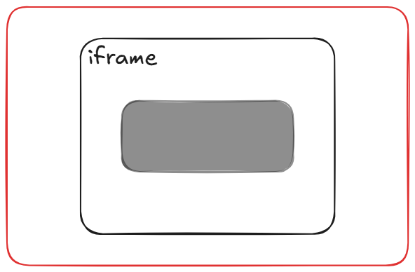
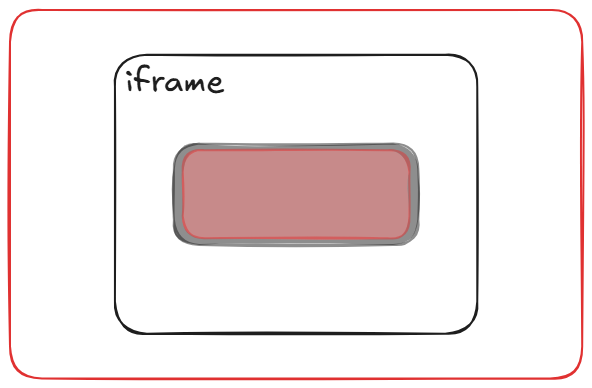
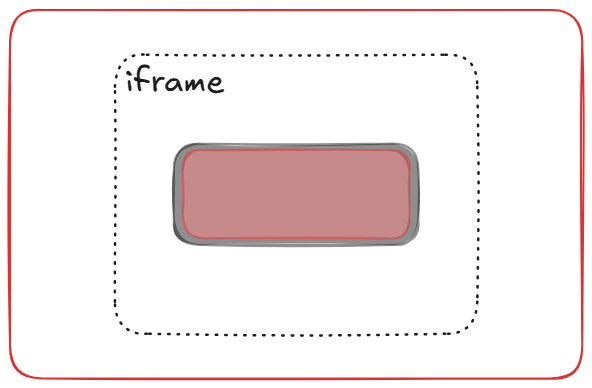

+++
weight = 60
+++

{}

## <code>Clickjacking</code>
UI redressing attack

---

## In CSRF
<span class="fragment">Auto form</span>

---

要送出的請求比較複雜  

{}
沒辦法用 Auto form 實現
ex. PUT / DELETE method
ex. custom header
ex. custom content-type
{}

---

### DEMO

[Lab: Clickjacking-DEMO](https://github.com/hlc23/CS-Labs/tree/main/clickjacking-demo)

{}


---

{}

## <code>How Clickjacking works?</code>

---

使用者直接操作  
<span class="fragment">包裝 iframe</span>

{}
讓使用者看到的畫面和實際點擊的畫面不一樣
{}

---

## <code>\<iframe\></code>  
把一個網頁嵌入到另一個網頁中

---

#### <code>YouTube</code>
<iframe width="800" height="400" src="https://www.youtube.com/embed/Gjnup-PuquQ" title="Docker in 100 Seconds" frameborder="0" allow="accelerometer; autoplay; clipboard-write; encrypted-media; gyroscope; picture-in-picture; web-share" referrerpolicy="strict-origin-when-cross-origin" allowfullscreen></iframe>

---

#### <code>Facebook</code>
<iframe src="https://www.facebook.com/plugins/post.php?href=https%3A%2F%2Fwww.facebook.com%2Fcmrdb%2Fposts%2Fpfbid0paK76vNFsurjXxVcHfut34k2prbdR1ydEDKjRKr2mZWnQi8CGoSfu51fXU3kfhF3l&show_text=true&width=500" width="500" height="400" style="border:none;overflow:hidden" scrolling="no" frameborder="0" allowfullscreen="true" allow="autoplay; clipboard-write; encrypted-media; picture-in-picture; web-share"></iframe>

---

JS 可以做很多怪事  
<span class="fragment">可以控制嵌入的網頁嗎 ?</span>

{}
被嵌入的網頁要視為獨立的網頁
{}

---

### <code>Same-Origin Policy (SOP)</code>
- 限制不同來源的網頁互相存取資源  

<span class="fragment"><span class="fragment highlight-green"> Same-Origin</span> </span>

---

#### <code>Origin</code>
scheme + host + port

---

#### <code> Same-Site</code> vs <code>Same-Origin</code>

{}
{}
- registed domain
- no port
{}
{}
- host
- port
{}
{}

<span class="fragment">Same-Origin 保證 Same-Site</span>


---





---





---





---

```css
iframe {
    position: absolute;
    z-index: 1; /* On top */
    opacity: 0; /* Initially hidden */
}
```

---

```html
<style>
    iframe {
        position:relative;
        width: 1000px;
        height: 1000px;
        opacity:  0.4;
        z-index: 2;
    }
    div {
        position:absolute;
        top: $top px;
        left: $left px;
        z-index: 1;
        width: $width px;
        height: $height px;
        background: red;
    }
</style>
<div>Click me</div>
<iframe src="[XXX]"></iframe>
```

{}

---

{}

## <code>Prevent Clickjacking</code>

---

不被嵌入就行了

---


---

### <code>Frame Busting</code>
Framekiller

---

```js
if (window.top !== window.self) {
    window.top.location = window.location;
}
```

<span class="fragment"><code>window.top 最上層的網頁</code></span>  
<span class="fragment"><code>window.self 自己的網頁</code></span>

{}
每個網頁都有自己的 window object  
window.top: 最上層的 window object  
window.self: 自己的 window object
{}

---

就不會被嵌入了  
 <span class="fragment">嗎 ?</span>

---

### <code>Frame Busting Bypass</code>
```html
<iframe src="XXX.com" sandbox="allow-forms"></iframe>
```
<span class="fragment">sandbox: 限制 iframe</span>    
<span class="fragment">[MDN doc: iframe](https://developer.mozilla.org/en-US/docs/Web/HTML/Reference/Elements/iframe#sandbox)</frame>

---

```html
<style>html{display:none;}</style>
<script>
   if (self == top) {
       document.documentElement.style.display = 'block'; 
   } else {
       top.location = self.location; 
   }
</script>
```

{}
self: window.self

不給 JS 就不給看
{}

{}

---

{}

## 現代防護機制

---

### <code>HTTP Response Header</code>

```response
X-Frame-Options: DENY
X-Frame-Options: SAMEORIGIN
X-Frame-Options: ALLOW-FROM https://example.com
```

{}
DENY: 完全禁止被嵌入  
SAMEORIGIN: 只允許同源網域嵌入
ALLOW-FROM: 允許特定網域嵌入 
ALLOW-FROM 已被大部分瀏覽器淘汰，建議使用 Content-Security-Policy 的 frame-ancestors 指令取代
{}

---

### <code>Content-Security-Policy</code>

```response
Content-Security-Policy: [policy]
Content-Security-Policy: frame-ancestors 'self';
Content-Security-Policy: frame-ancestors normal-website.com;
```

---

{}

---

{}

## Labs
<ul>
    <li class="fragment">None</li>
</ul>

---

### <code>Burp Lab</code>
- [Lab: Basic clickjacking with CSRF token protection](https://portswigger.net/web-security/clickjacking/lab-basic-csrf-protected)
- [Lab: Clickjacking with form input data prefilled from a URL parameter](https://portswigger.net/web-security/clickjacking/lab-prefilled-form-input)

{}

