+++
weight = 80
+++

{}

## <code>Session Hijacking</code>

---

<ul>
    <li class="fragment">XSS</li>
    <li class="fragment">Network-level attacks (e.g., MITM)</li>
    <li class="fragment">Session fixation</li>
</ul>

{}

---

{}

## XSS

---

### <code> Quick XSS Explain</code>

---

- Reflected XSS
- Stored XSS
- DOM-based XSS

---

#### <code>Reflected XSS</code>

```text {lineNos=false}
http://website.com/search?q=Apple
```

```html {lineNos=false}
Results for search: Apple
...
```

---

```text {lineNos=false}
http://website.com/search?q=<script>alert('XSS')</script>
```

```html {lineNos=false}
Results for search: <script>alert('XSS')</script>
...
```

---

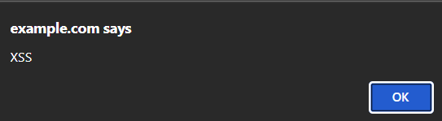

---

#### <code>Stored XSS</code>
Store the payload in the server

---

在留言板留下了
```html
<script>alert('XSS')</script>
```

<span class="fragment">其他人瀏覽留言板時就會觸發</span>

---

#### <code>DOM-based XSS</code>

{}
DOM: Document Object Model
JavaScript 操作網頁的方式
JS 讀取或修改 DOM 內容
{}

---

```text {lineNos=false}
http://website.com/greet?name=Alice
```

```html
<input id="name" type="text" />
<div id="greet"></div>
<script>
  var name = new URL(location).searchParams.get("name");
  document.getElementById("greet").innerHTML = "Hello " + name;
</script>
```

{}
主打不需要跟伺服器互動
完全在使用者瀏覽器端執行
{}

---



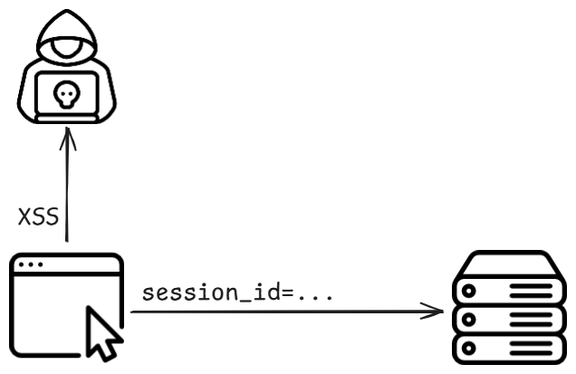

---



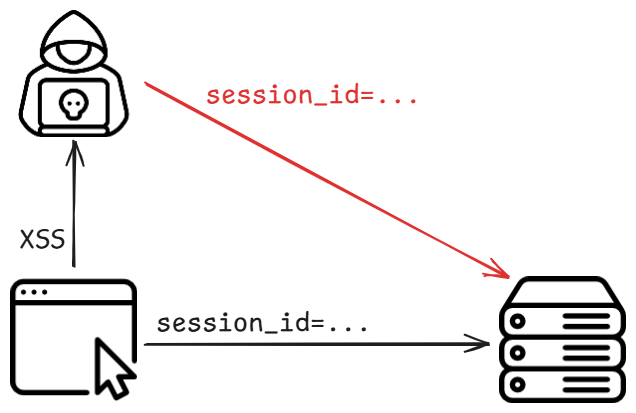

---

[Burp: XSS Cheat Sheet](https://portswigger.net/web-security/cross-site-scripting/cheat-sheet)

---

[Lab: Session-Hijacking-XSS](https://github.com/hlc23/CS-Labs/tree/main/Session-Hijacking-XSS)

{}

---

{}

## MITM
Man-In-The-Middle Attack

---




---



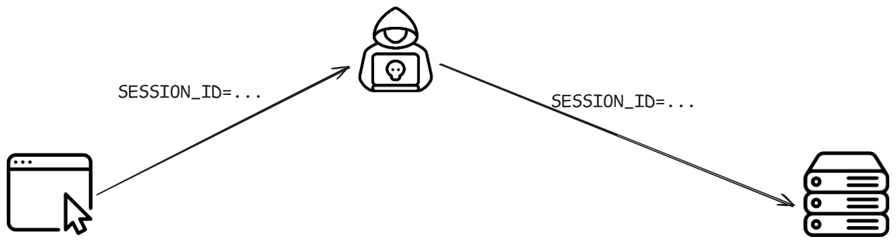

---




---

- WPAD attack
- Downgrade attack
- ARP Spoofing
- ...

{}
WPAD: Web Proxy Auto-Discovery Protocol (For LAN)
Downgrade attack:(e.g., SSL Stripping)
將較安全的協定降級為較好破解的協定 
ARP: Address Resolution Protocol (For LAN)
{}

---

### <code>ARP Spoofing</code>
<span class="fragment">ARP: Address Resolution Protocol</span>


{}
L2
用來將 IP 位址對應到 MAC 位址
{}

---




---



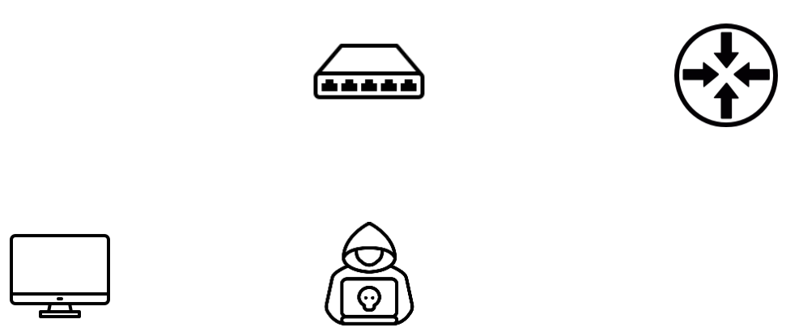

---




---



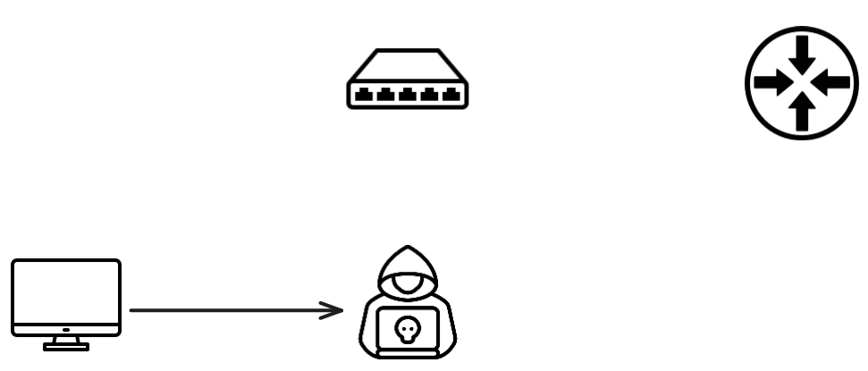

---



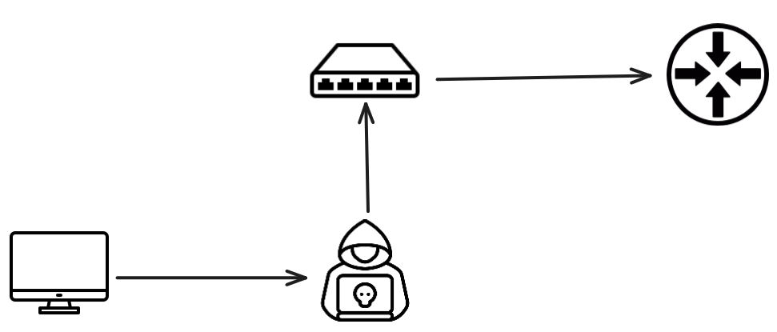

---


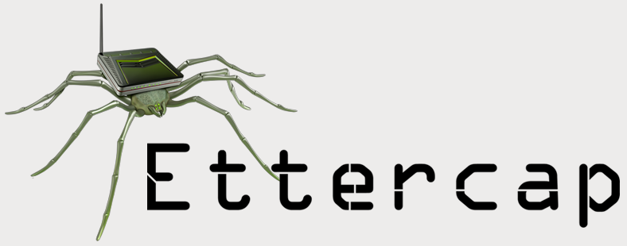

---

[ithelp: 做IT必備的資安觀念！手把手帶你攻防實戰](https://ithelp.ithome.com.tw/m/articles/10302438)

---

#### DEMO
<span class="fragment">實戰演練</span>

---


---


---

- [Github: docker-arp-spoofing](https://github.com/themithy/docker-arp-spoofing)

{}

---

{}

## Session Fixation

---

攻擊者事先取得一個合法的 session ID  
誘使使用者登入該 session ID

---

```url {lineNos=false}
http://website.com/login?sessionid=attacker-session-id
```

---



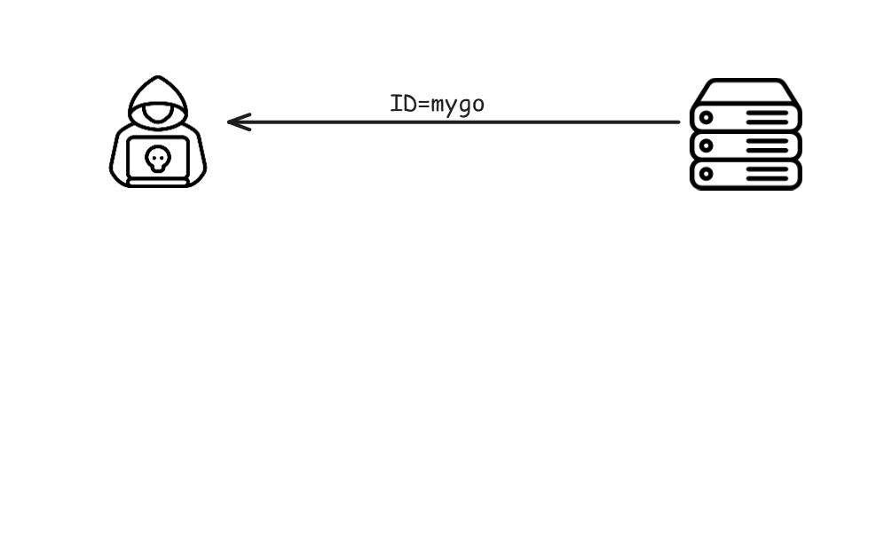

---


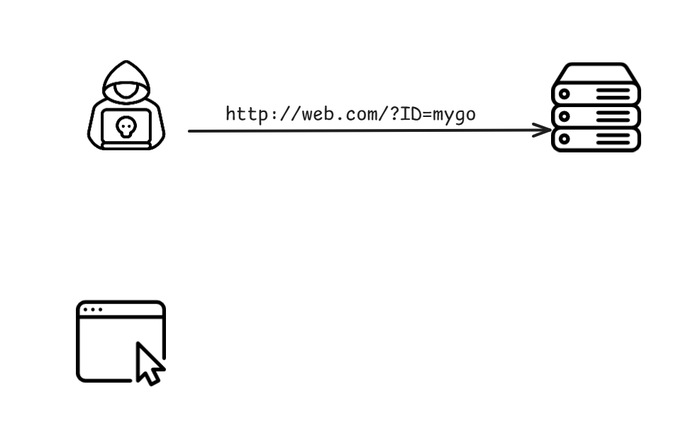

---


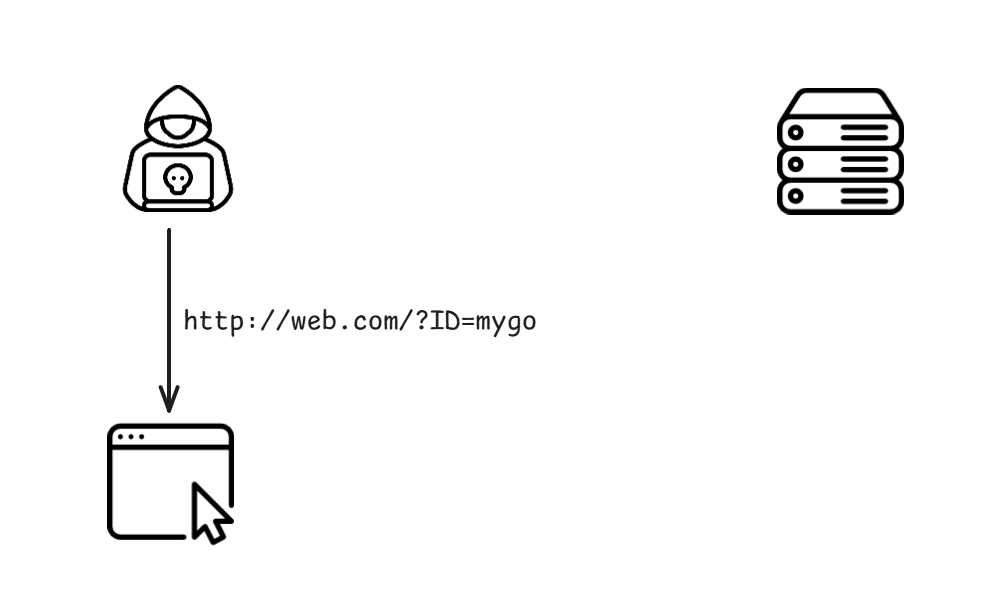

---


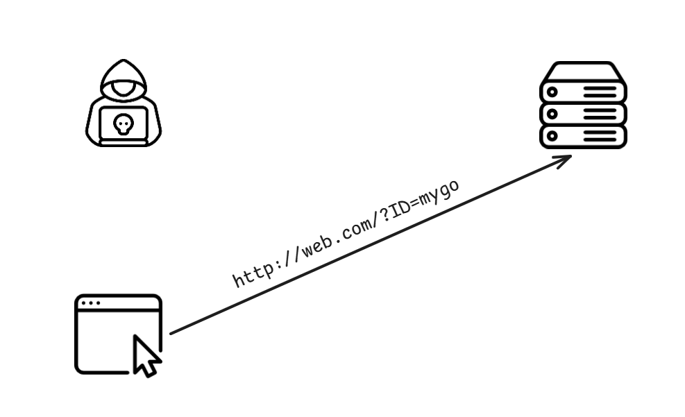

---

### Lab
- [Lab: Session-Fixation-demo](https://github.com/hlc23/CS-Labs/tree/main/Session-Fixation-demo)

{}

---

{}

## Prevention

---

### HTTPS

---

### <code>Cookie</code>
- ~~餅乾守護大作戰~~
- Secure
- HttpOnly
- SameSite
- CSP

---

### <code>Session</code>
- Rotation
- Expiration

{}
