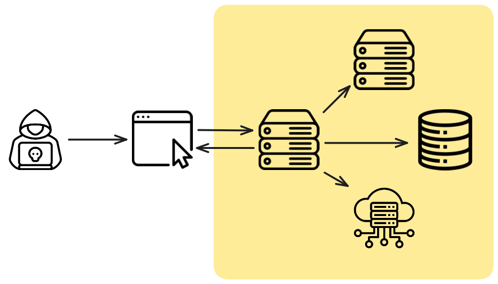
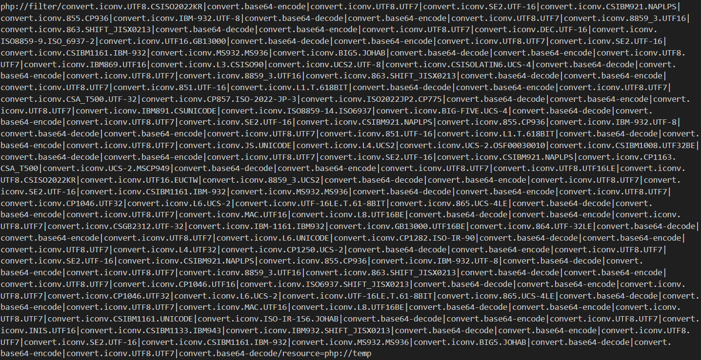
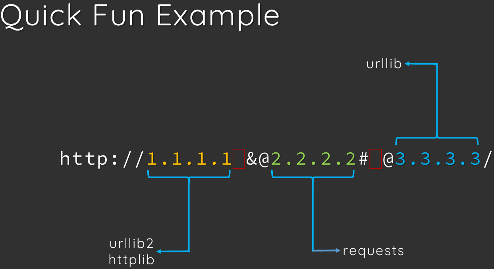

+++
weight = 70
+++

{}

# SSRF

---

## What is SSRF?

---

<ul>
  <li class="fragment">Server-Side Request Forgery</li>
  <li class="fragment">攻擊者利用<span style="color:yellow">伺服器</span>發送惡意請求</li>
</ul>

---

### DEMO

[Lab: SSRF-DEMO](https://github.com/hlc23/CS-Labs/tree/main/ssrf-demo)

{}

---

{}

## How SSRF works?

---

因為伺服器通常有較高的權限   
<h3 class="fragment">可以連線到內部網路或其他受限資源</h3>

---




{}

---

{}
<span style="color:yellow">scheme://</span><span style="color:green">authority</span>/<span style="color:blue">path</span>

---

<span style="color:yellow;">scheme://</span>authority/path  

<span class="fragment">SSRF 攻擊面</span>

---

#### Local protocols
- file://
- Java
  - netdoc://
- PHP
  - https://www.php.net/manual/en/wrappers.php
- ...

---

#### PHP Wrappers
<span class="fragment">filter chain</span>  
<span class="fragment">LFI2RCE</span>

---

```php
<?php phpinfo(); ?>
```

---



---

[php_filter_chain_generator](https://github.com/synacktiv/php_filter_chain_generator)

---

### Remote
- http://
- https://
- ftp://
- gopher://
- ...

---


---

#### http & https 

---

#### gopher://

<span class="fragment">萬用協議</span>  
<span class="fragment">建構任意 TCP 封包</span>  
<span class="fragment">有點老 有用但不多</span>

---

[Just Gopher It: Escalating a Blind SSRF to RCE for $15k — Yahoo Mail](https://sirleeroyjenkins.medium.com/just-gopher-it-escalating-a-blind-ssrf-to-rce-for-15k-f5329a974530)

---

`gopher://host:port/_<data>`

---

payload generator:  
[Gopherus](https://github.com/tarunkant/Gopherus)

---

- http / https
- Redis
- MySQL
- ...

{}

---

{}

scheme://<span style="color:yellow;">authority</span>/path  

<span class="fragment">決定能不能 SSRF</span>

---

能不能連線到目標?  
- blacklist
- whitelist
- DNS resolution

---

### Blacklist
```py
@app.route("/mkreq1", methods=["GET"])
def make_request1():
    url = request.args.get("url")
    if urlparse(url).hostname in [
                    "localhost", 
                    "127.0.0.1", 
                    "::1"]:
        return "badhacker"
    return requests.get(url, verify=False, timeout=2).text
```

---

#### Bypass 127.0.0.1
- 127.0.1
- 0
- decimal: 2130706433
- hex: 
  - 0x7f000001
  - 0x7f.0x0.0x0.0x1
- octal: 017700000001

---

#### Bypass 127.0.0.1

- IPv6: 
  - ::1
  - ::127.0.0.1
  - ::ffff:127.0.0.1
  - ::1%1

---

#### Bypass by domain name
- wildcard DNS
  - nip.io
  - sslip.io
- localhost
  - localtest.me
  - XXX.localtest.me
- IDN encoding
  - 中文.台灣

---

### Whitelist
```py
@app.route('/mkreq', methods=['GET'])
 def make_request():
    url = request.args.get('url')
    if not urlparse(url).hostname.startswith("google.com"):
        return "badhacker"
    return requests.get(url).text
```

<span class="fragment">只允許 google.com</span>
<span class="fragment">安全嗎?</span>

---

#### Open Redirect

自動跳轉到其他網頁

<span class="fragment">https://XXX.com/login?redirect=https://evil.com</span>

---

如果能控制跳轉網址  
<span class="fragment">表面上是 A 網頁</span>  
<span class="fragment">連線到 B 網頁</span>
{}
有些 bug bounty 會收
{}

---

- https://google.com/amp/s/example.com
- https://httpbin.dev/redirect-to?url=http://example.com
- ...

---

Redirect by svg
```html
<code>
<?xml version="1.0" encoding="UTF-8" standalone="yes"?>
  <svg
  onload="window.location='http://www.example.com'"
  xmlns="http://www.w3.org/2000/svg">
</svg>
</code>
```

---

### DNS resolution
```py
@app.route('/mkreq', methods=['GET'])
 def make_request():
    url = request.args.get('url')
    host = urlparse(url).hostname
    if socket.gethostbyname(host) == '127.0.0.1':
        return "badhacker"
    return requests.get(url).text
```

<span class="fragment">先檢查連到哪</span>  
<span class="fragment">安全嗎?</span>

---

#### DNS Rebinding
- 一個 domain 綁兩個 A record
  - evil.com -> 8.8.8.8
  - evil.com -> 127.0.0.1

- https://github.com/taviso/rbndr
- [rebinder](https://lock.cmpxchg8b.com/rebinder.html)

---

Wired Url Parsing

- 🍊
- [Blackhat USA 2017](https://blackhat.com/docs/us-17/thursday/us-17-Tsai-A-New-Era-Of-SSRF-Exploiting-URL-Parser-In-Trending-Programming-Languages.pdf)

---



---

{}

---

{}

## Labs

---

- [Lab: SSRF-waf](https://github.com/hlc23/CS-Labs/tree/main/SSRF-waf)
- [Lab: SSRF-PHP-LFI](https://github.com/hlc23/CS-Labs/tree/main/SSRF-PHP-LFI)
- [Lab: SSRF-cmdi](https://github.com/hlc23/CS-Labs/tree/main/SSRF-cmdi)

{}
`https://httpbin.org/redirect-to?url=http%3A%2F%2Fadmin%3A5001%2Fadmin%2Fping%3Fhost%3D1.1.1.1%3Bcat%2520%2Fapp%2Fflag.txt`
{}

{}