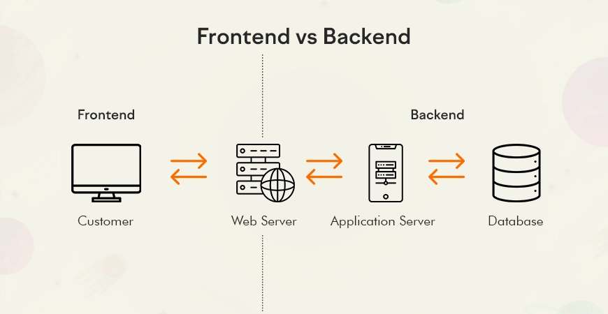

+++
weight = 10
+++

{}

# 什麼是「網頁」？

---

## Web 的組成

---

{}
{}
### Frontend (前端)
**使用者看得見的部分**

- HTML (結構)
- CSS (樣式)
- JavaScript (互動)
{}

{}
### Backend (後端)
**使用者看不見的部分**

- 資料庫
- 伺服器邏輯
- API
{}
{}

---

## 我們今天專注在...

<h3 style="color:#4ade80">Frontend 前端開發</h3>

製作靜態網頁不需要後端！

{}
