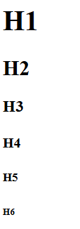
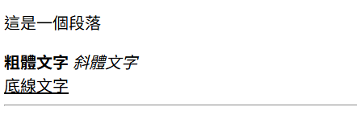
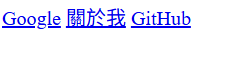
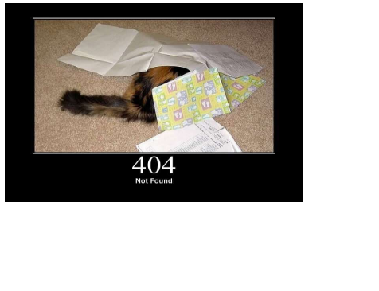
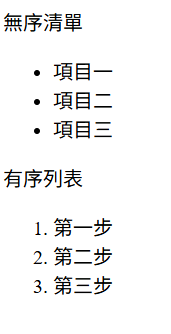

+++
weight = 20
+++

{}

# HTML 基礎
## HyperText Markup Language

---

## 什麼是 HTML？

- **H**yper**T**ext **M**arkup **L**anguage
- 超文本標記語言
- 定義網頁的**結構**、**語意**和**內容**
- 使用「標籤」(tags) 來標記內容

---

## HTML 基本結構

```html
<!DOCTYPE html>
<html lang="zh-TW">
<head>
    <meta charset="UTF-8">
    <title>我的第一個網頁</title>
</head>
<body>
    <h1>Hello, World!</h1>
</body>
</html>
```

---

## HTML 標籤結構

```html
<tagname>內容</tagname>
```

<ul>
<li class="fragment"><code>&lt;tagname&gt;</code> - 開始標籤</li>
<li class="fragment"><code>&lt;/tagname&gt;</code> - 結束標籤</li>
<li class="fragment">內容 - 放在標籤之間</li>
</ul>

<p class="fragment">
有些標籤不需要結束標籤
</p>

---



## 標題標籤

```html
<h1>最大的標題</h1>
<h2>第二大的標題</h2>
<h3>第三大的標題</h3>
<h4>第四大的標題</h4>
<h5>第五大的標題</h5>
<h6>最小的標題</h6>
```

<p class="fragment">💡 <code>&lt;h1&gt;</code> 通常一個頁面只用一次（主標題）</p>

---




---


## 段落與文字

```html
<p>這是一個段落</p>

<strong>粗體文字</strong>
<em>斜體文字</em>
<u>底線文字</u>

<br>  <!-- 換行 -->
<hr>  <!-- 水平分隔線 -->
```

---




---

## Comment 註解

```html
<!-- 這是一個註解 -->
<p>這段文字會顯示在網頁上</p>
<!--
    多行註解
-->
```

<div class="fragment">

In VS Code: <span style="color: yellow">Ctrl + /</span> 可以快速加入/移除註解

</div>

---

## 連結標籤

```html
<!-- 外部連結 -->
<a href="https://google.com">Google</a>

<!-- 內部頁面 -->
<a href="/about.html">關於我</a>

<!-- 開新分頁 -->
<a href="https://github.com" target="_blank">
    GitHub
</a>
```

---



 

---

## 圖片標籤

```html


```

<ul>
<li class="fragment"><code>src</code> - 圖片來源 (必填)</li>
<li class="fragment"><code>alt</code> - 替代文字 (必填，無障礙設計)</li>
<li class="fragment"><code>width</code> - 寬度 (選填)</li>
<li class="fragment"><code>height</code> - 高度 (選填)</li>
</ul>

---




---

## 列表

```html
<!-- 無序列表 -->
<ul>
    <li>項目一</li>
    <li>項目二</li>
    <li>項目三</li>
</ul>

<!-- 有序列表 -->
<ol>
    <li>第一步</li>
    <li>第二步</li>
    <li>第三步</li>
</ol>
```

---




---

## 容器標籤

```html
<!-- div: 區塊容器 (block-level) -->
<div>
    <h2>區塊標題</h2>
    <p>區塊內容</p>
</div>

<!-- span: 行內容器 (inline) -->
<p>這是<span style="color:red">紅色</span>文字</p>
```

<div class="fragment">
💡 div 和 span 本身沒有任何樣式或語意，主要用來包裝內容  
    但可以用 CSS 來為它們添加樣式
</div>

---

## HTML 屬性

```html
<tag attribute="value">內容</tag>
```

常見屬性：
- `id` - 唯一識別碼
- `class` - 類別名稱（可重複）
- `style` - 內嵌樣式
- `src` - 來源
- `href` - 連結

---

## 🎯 實作練習 1

<div class="fragment">


</div>

---


建立一個簡單的自我介紹頁面，包含：

1. 一個 `<h1>` 主標題（你的名字）
2. 一張照片 ``
3. 一個段落 `<p>` 介紹自己
4. 一個列表 `<ul>` 列出 3 個興趣
5. 一個連結 `<a>` 到你的社群媒體
---

## 🎯 練習解答範例

```html
<!DOCTYPE html>
<html lang="zh-TW">
<head>
    <meta charset="UTF-8">
    <title>關於我</title>
</head>
<body>
    <h1>張小明</h1>
    
    <p>大家好，我是一個網頁開發初學者！</p>
    <h2>我的興趣：</h2>
    <ul>
        <li>程式設計</li>
        <li>閱讀</li>
        <li>旅行</li>
    </ul>
    <a href="https://github.com/username">我的 GitHub</a>
</body>
</html>
```

{}
