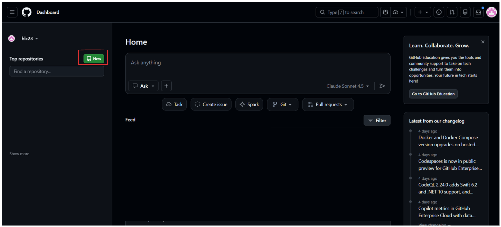
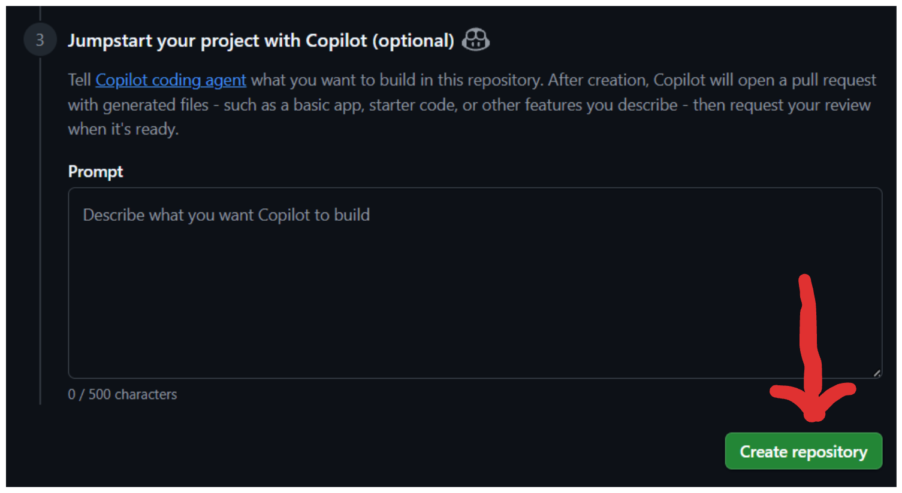

+++
weight = 50
+++

{}

# 部署到 GitHub Pages
## 讓全世界看到你的網站！

---

## 什麼是 GitHub Pages？

- GitHub 提供的**免費**網站託管服務
- 自動從你的 Repository 建立網站
- 支援自訂網域
- 適合靜態網站（HTML/CSS/JS）

---

## 部署步驟

### 1. 建立 GitHub Repository
1. 登入你的 GitHub 帳號
2. 點選右上角的 **+**，選擇 **New repository**
3. Repository name: `my-website`
4. Create repository

---



---


---



---

### 2. 前往 Repository 設定

1. 在 GitHub 網站開啟你的 Repository
2. 點選 **Settings** (設定)
3. 在左側選單找到 **Pages**

---

## 部署步驟

### 3. 設定 GitHub Pages

在 **Source** 區域：

1. Branch: 選擇 `main`
2. Folder: 選擇 `/ (root)`
3. 點選 **Save**

---

## 等待部署

<ul>
<li class="fragment">⏳ GitHub 會自動開始部署</li>
<li class="fragment">⏳ 通常需要 1-2 分鐘</li>
<li class="fragment">✅ 完成後會顯示網址</li>
</ul>

---

## 你的網站網址

```text
https://你的用戶名.github.io/my-first-website/
```

例如：
```text
https://hlc23.github.io/my-first-website/
```

---

## 🎉 完成了！

- 點選網址就能看到你的網站
- 可以分享給朋友
- 每次 Push 新的 commit，網站會自動更新

---

## 檢查部署狀態

在 Repository 頁面：

1. 點選 **Actions** 標籤
2. 可以看到部署的進度和歷史
3. ✅ 綠色勾勾表示成功
4. ❌ 紅色叉叉表示失敗

---

## 常見問題

### 404 Not Found

可能原因：
- 檔案名稱不是 `index.html`
- 檔案在子資料夾內
- 還在部署中（等 1-2 分鐘）

---

## 常見問題

### CSS/圖片載入失敗

檢查路徑：

```html
<!-- ❌ 絕對路徑 -->
<link rel="stylesheet" href="/style.css">

<!-- ✅ 相對路徑 -->
<link rel="stylesheet" href="style.css">
```

---

## 更新網站

1. 在本地修改檔案
2. 上傳到 GitHub
4. 等待 1-2 分鐘，網站自動更新

---

## 🎯 實作練習 3

完整流程練習：

1. 建立一個簡單的網站專案
2. 建立 GitHub Repository
4. 啟用 GitHub Pages
5. 確認網站可以正常訪問
6. 修改內容並更新網站

---

## 專案範例：個人名片網站

建議包含：

- 標題和你的名字
- 簡短自我介紹
- 個人照片
- 連結（GitHub、Email 等）

{}
